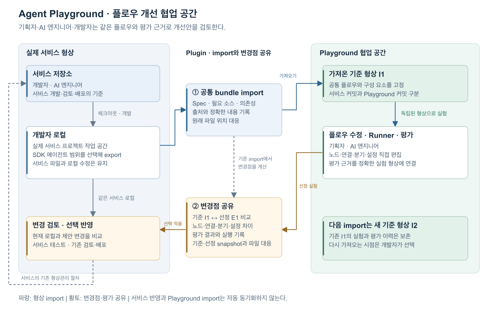

# Agent Playground 산출물과 형상관리

> 작성일: 2026-10-07. 상태: 상위 기획의 상세 설계안.
> 관련 문서: [기획 초안](./agent-playground-draft.md), [Python SDK 스펙](./agent-sdk-spec.md).

## 1. 협업과 형상관리

**Playground는 흐름을 직접 수정하고 평가하는 협업 공간이다.** 실제 서비스 저장소와 KPAP의 별도 Playground GitHub 저장소는 독립적으로 관리한다. 개발자의 로컬은 실제 서비스 프로젝트다. Plugin은 에이전트 import와 변경 제안 공유를 연결한다.

| 대상 | 관리 기준 |
| --- | --- |
| 실제 서비스 형상 | 기존 저장소에서 개발·검토·배포한다. |
| Playground 기준 형상 | 가져온 에이전트 묶음과 출처를 고정한다. 새 import는 새 기준 형상을 만든다. |
| 개별 작업본 | 같은 기준 형상에서 사용자가 각자 흐름·설정을 편집한다. |
| 실험 형상 | 전체 Spec과 필요한 파일을 고정 snapshot·Playground commit으로 저장한다. |
| 변경 제안·평가 | 같은 실험 형상과 결과 링크를 보고 선정·검토한다. |

초기 협업은 같은 기준, 개별 작업본, 고정 실험 버전과 공동 결과 검토를 제공한다. 실시간 동시 편집은 초기 범위에 포함하지 않는다. 기존 기준 형상과 실험은 새 import로 덮어쓰지 않는다. 실제 서비스 반영은 소유 개발자가 결정한다.

## 2. 라이프사이클 도식



서비스에서 가져오는 것은 에이전트 묶음이다. 개발자에게 전달하는 것은 변경 제안과 평가 근거다. 두 저장소를 자동 동기화하지 않는다. 수정본은 새 세션에서 시험하고 기존 대화는 기존 형상을 유지한다.

## 3. 공통 import 묶음

SDK export와 plugin은 같은 에이전트 묶음 형식을 사용한다. 서비스 전체를 복제하지 않는다. 개발자는 필요한 범위를 선택한다.

| 항목 | 포함할 내용 |
| --- | --- |
| 정의 | 전체 Spec, 공개 설정, 흐름 수정 권한, 입출력·설정 스키마와 매핑 |
| 구현 | 필요한 Python 소스, 등록 구성 요소와 정확한 버전·패키지 해시 |
| 실행 자료 | 고정 의존성 lock, 필요한 파일·리소스, 진입점, SDK·실행기 버전 |
| 실행 환경 | 런타임·모델·도구 환경 참조와 필요한 계약. 자격증명은 제외한다. |
| 출처·대응 | 서비스 저장소·경로·커밋, 미커밋 여부, 파일 대응, 가져온 실제 내용과 해시 |

import ID는 가져오기 단위를 식별한다. 기준 snapshot과 Playground commit·경로를 함께 기록한다. 출처 커밋만으로 로컬 내용을 식별하지 않는다. 미커밋 파일과 필요한 미추적 파일도 선택 범위에 포함해 내용을 고정한다.

이미 Stage에서 검증한 동일 묶음은 snapshot ID를 재사용할 수 있다. Spec·소스·의존성·실행 환경의 동일성을 확인하고 새 import의 출처와 대응 경로를 기록한다. 내용이 바뀌면 새 snapshot을 만든다.

공통 Spec을 읽어 흐름을 가져온다. 임의 Python graph를 자동 역변환하지 않는다. 커스텀 구현은 내부 코드를 보존한다. 등록된 실행부는 입출력 매핑과 자식 세션 계약을 통해 공통 graph의 노드로 연결한다. 내부 코드 개선은 실제 서비스 프로젝트에서 수행하고 새 묶음을 import한다.

## 4. 편집 이력과 실험 고정

기획자와 AI 엔지니어는 허용된 노드·연결·분기·설정을 직접 수정한다. 서버는 기준 권한과 승인 구성 요소를 검사한다. 권한 자체는 실험자가 변경하지 않는다. 추가 구성 요소의 버전·패키지·의존성을 고정한다.

편집 이력은 작성자, 시각, 기준 import, 이전 revision과 작업을 기록한다. **개별 편집 이력과 최종 변경 제안은 구분한다.** 제안은 기준 snapshot과 선정 snapshot의 의미상 차이로 만든다. 되돌린 작업은 최종 제안에 포함하지 않는다.

저장은 전체 Spec snapshot과 Playground commit을 만든다. 서버는 예상 revision으로 저장 충돌을 검사한다. 미완성 작업본도 저장할 수 있다. 실행 전에는 전체 graph의 연결·분기·입출력·스키마와 실행 요구를 검증한다.

노드·연결·분기는 안정 ID로 비교한다. 연결은 출발 노드·포트와 도착 노드·포트의 안정 키를 사용할 수도 있다. 새 노드·복제 노드는 새 ID를 받는다. 삭제한 ID는 재사용하지 않는다. 화면 배치 변경은 실행 의미 변경과 분리한다.

작업본 상태는 `DRAFT`, `VALIDATED`, `INVALID`로 구분한다. 별도 실행 준비 작업은 SDK의 `RECEIVED → VALIDATING → BUILDING → PREPARING → READY` 상태를 따른다. 준비 실패는 `FAILED`다. 검사를 통과하지 못했거나 준비가 실패한 형상은 실행하지 않는다. 기존 CI의 wheel 준비 경로를 유지한다. 코드·구성 요소·의존성이 바뀌면 패키지와 환경을 다시 준비한다.

Spec만 바뀌어 기존 패키지를 재사용하는 경우, 선정 Spec 전체를 SDK graph 실행기에 전달한다. 이전 Python factory의 흐름에 설정만 덮어씌워 실행하지 않는다. 실제 적용 Spec 해시와 패키지·환경을 실행 기록에 남긴다. 구체 호출 계약은 Python SDK 스펙을 따른다.

평가는 정확한 실험 commit, Spec·패키지·lock·SDK·실행기·런타임과 테스트 셋·평가 기준·시험 조건에 연결한다. 로그와 평가 데이터 원문은 해당 저장 서비스에 두고 Git에는 참조를 기록한다.

## 5. 변경 제안 export와 개발자 인계

개발자에게 전달할 묶음은 다음 순서로 만든다.

1. 검증된 선정 snapshot과 그 기준 import를 고정한다.
2. 두 snapshot을 비교해 노드·연결·분기·설정의 변경 전후 값을 만든다.
3. 전체 기준·선정 snapshot, 최종 변경 목록, 소스 manifest와 필요한 소스 blob을 포함한다. 새 구성 요소·리소스·의존성 참조와 lock도 포함한다.
4. 선정 실험의 실행 형상과 일치하는 평가 참조를 연결한다. 미평가 형상은 참조를 비우고 미평가로 표시한다.
5. 파일 해시와 경로 대응을 검사한다. 묶음이 완전하면 `EXPORTED`, 누락·불일치는 `EXPORT_FAILED`로 표시한다.

`proposal.json`의 최소 구조는 다음과 같다. 해시는 실제 값으로 기록한다.

```json
{
  "format_version": "1.0", "proposal_id": "proposal-01", "agent_id": "search-agent",
  "baseline": {
    "import_id": "import-01", "snapshot_hash": "...", "playground_commit": "...",
    "source_revision": {"repository": "...", "commit": "...", "dirty": true},
    "content_hash": "..."
  },
  "selected": {
    "snapshot_hash": "...", "playground_commit": "...", "spec_hash": "...",
    "component_manifest_hash": "...", "lock_hash": "...", "execution_hash": "..."
  },
  "changes": [{"op": "config.set", "node_id": "search", "path": "/top_k", "before": 5, "after": 10}],
  "evaluation_refs": [{"evaluation_id": "eval-01", "execution_hash": "...", "result_ref": "..."}],
  "path_mappings": [{"bundle_path": "selected/agent-spec.json", "service_path": "agents/search/agent-spec.json", "base_hash": "...", "apply_mode": "spec"}]
}
```

`execution_hash`는 Spec·패키지·lock·SDK·실행기·런타임을 포함한 실행 형상을 식별한다. 평가 참조의 값은 선정 실험과 일치해야 한다. 변경 비교에 두 저장소 전체의 차이를 사용하지 않는다.

Plugin은 기준 snapshot, 선정 snapshot, 현재 서비스 로컬을 구조로 비교한다. 대응 경로, 노드·연결·설정과 관련 코드·스키마·의존성의 변경을 확인한다. 예를 들어 기준값 5, 제안 10, 현재값 8이면 세 값을 표시하고 충돌을 알린다.

선택 적용은 공통 Spec과 대응 경로가 명확한 항목에 한정한다. 개발자가 선택한 변경의 미리보기를 보여주고 스키마와 전체 graph를 검증한다. 쓰기 직전에 로컬 해시를 다시 확인한다. 관련 파일은 임시 결과와 백업을 만든 뒤 적용한다. 적용 중 실패하면 백업으로 복구한다. 부분 적용 상태를 완료로 표시하지 않는다. 서비스 전체를 덮어쓰지 않는다.

임의 Python에서 정의를 생성하는 경우는 변경 제안을 보여주고 개발자가 수동 반영한다. Plugin은 코드를 자동 역수정하지 않는다. 소유 개발자는 반영·부분 반영·미반영과 이유를 기록한다. 실제 서비스 테스트와 기존 검토·배포 절차를 수행한다. Playground 평가를 다른 서비스 버전의 검증 결과로 사용하지 않는다.

반영 결과를 Playground에서 재시험하려면 새 import를 수행한다. 재import는 개발자가 선택한다. 서비스 형상과 자동 동기화하지 않는다.

## 6. 구현 범위와 후속 계약

Phase0는 공통 묶음, 자체 형상 저장, 고정 실행·평가와 수동 제안 export를 제공한다. Phase1은 Builder 흐름 편집, 편집 이력, plugin의 구조 비교·Spec 선택 적용을 제공한다. Playground의 Git 접근은 플랫폼이 처리한다.

후속 계약은 저장소 경로·조회 권한·보존 기간, 구성 요소 등록과 환경 준비, 묶음 스키마·해시 규칙, 파일 대응과 다중 파일 적용 방식이다. 기존 Java 문서의 실행 계약은 Python SDK 기준으로 조정한다. 서비스 Git 병합·배포는 기존 절차를 유지한다.

도식은 [PNG](./diagrams/agent-playground-lifecycle.png), [SVG](./diagrams/agent-playground-lifecycle.svg), [Mermaid 원본](./diagrams/agent-playground-lifecycle.mmd)으로 제공한다.
