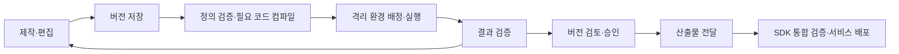

# Agent Playground 방향 제안과 판단 근거

> 목적: 제품 방향과 개발 범위를 논의할 판단 근거를 제시한다. 팀 합의 후 리더에게 방향 승인을 요청할 예정이다.
> 상태: 팀 논의용 권고안. 구현 방식과 범위는 합의 전이다. 작성일: 2026-10-05.
> 1차 목표: 11월에 CS 서브 결제 파일럿을 제공한다.
> 관련 문서: [제품 범위 및 개발 계획](agent-playground.md)

## 1. 제안 요약

**이번 제안의 목표는 비개발자의 검증 결과를 기존 서비스 적용까지 연결하는 것이다.**
같은 에이전트 산출물을 SDK에서 실행하면 인계 시 실행 로직의 재구현을 줄일 수 있다.
서비스의 권한·데이터·도구 연결은 별도 통합 검증이 필요하다.

아래 세 방향을 권고한다. 현재 요구에 적합하다고 판단한 이유와 감수할 비용을 함께 설명한다.
요구나 검증 결과가 달라지면 대안의 적합성도 달라질 수 있다.

| 항목 | 현재 상태 | 권고안 |
| --- | --- | --- |
| 제품 | Agent Playground의 기능 범위가 미정이다. | KPAP 아래의 제작·검증·공유 영역으로 정의하는 안 |
| 프레임워크 | CCAB는 Python LangGraph 코드를 만든다. | LangGraph4j 코어를 사내 Java SDK에 포함하는 안 |
| Stage Runner | CCAB는 로컬에서 Docker 이미지를 빌드하고 실행한다. | 고정 런타임 이미지와 에이전트 산출물을 분리하는 안 |

이 안은 CCAB의 자연어·스킬 제작 흐름을 재사용한다.
다만 코드 생성 규칙의 변경과 SDK·공통 실행 환경의 개발 비용이 발생한다.

### 요구 조건

| 확인된 요구 | 제안에 미치는 영향 |
| --- | --- |
| Java·Kotlin 서비스 내부에서 직접 실행 | 원격 실행 API보다 내장 실행 라이브러리가 요구에 맞는다. |
| JDK 17 이상 | Java 17을 생성 코드와 SDK의 기준으로 삼을 수 있다. |
| 서비스마다 다른 Spring·Spring Boot 버전 | Spring 의존성 없이 사용할 수 있어야 한다. |
| MySQL 중심의 DB 환경 | MySQL 저장 구현과 DDL의 우선순위가 높다. |
| 코드 산출물 허용, 외부 라이브러리 추가 금지 | 고정 SDK API를 사용하면 의존성 관리 범위를 줄일 수 있다. |
| 편집 후 실행 대기 3분 초과 지양 | 편집마다 필요한 준비 작업을 줄이는 구조가 유리하다. |

이 문서에서 **적용 서비스**는 SDK를 넣을 목적조직의 Java·Kotlin 서비스다.
**산출물**은 에이전트 정의, 노드 코드, 검증 사례, 버전 명세를 뜻한다.

## 2. 제품 브랜딩

### 변경 배경

**사용자의 작업은 코드 생성 후에도 계속된다.**
사용자는 CCAB 산출물을 공유하기 어렵다. 개발자는 인계받은 산출물에 추가 작업을 해야 한다.
서비스 적용 후에도 사용자는 에이전트 흐름을 수정해야 한다.

필요한 대고객 도구·데이터가 없으면 제작도 막힌다.
제작 화면만으로는 이 문제를 해결하기 어렵다.
도구 연결, 실행 확인, 수정, 인계를 함께 제공하는 방향이 필요한 이유다.

### 권고안

**“KPAP Agent Playground — 에이전트 제작·검증·공유”라는 명칭을 권고한다.**
기존 KPAP와의 관계를 보여주고, 1차 제공 기능을 설명하기 위한 제안이다.

| 이름 | 제안하는 역할 |
| --- | --- |
| KPAP | 기존 AI 플랫폼의 이름이다. |
| Agent Playground | 사용자가 에이전트를 제작·검증·공유하는 영역이다. |
| Builder | 에이전트 정의와 코드를 제작·편집한다. |
| Stage Runner | 제작 단계의 에이전트를 실행한다. 결과와 오류를 제공한다. |
| SDK | 검증한 산출물을 적용 서비스 안에서 실행한다. |

이 안에서는 Agent Playground 명칭을 유지하면서 적용 범위를 명확히 한다.
후속 배포·운영 기능의 명칭은 해당 기능의 범위가 정해질 때 검토할 수 있다.

### 근거와 이유

| 이유 | 기대하는 변화 |
| --- | --- |
| 사용자 작업을 연결한다. | 비개발자는 실행 결과를 보고 수정한다. 동료와 개발자는 같은 버전의 결과를 확인한다. |
| KPAP 자산을 사용한다. | 프롬프트 관리, 도구 관리, LLM Gateway를 제작 경험에 연결한다. |
| 제품의 책임을 명확히 한다. | Playground는 제작 단계의 검증을 맡는다. 적용 서비스는 통합 검증과 대고객 운영을 맡는다. |

**제품의 투자 근거는 제작·검증·인계 문제의 해결이다.**
CS 서브 결제 파일럿은 이 가치를 확인할 첫 사례다.
확인할 성과의 범위도 해당 업무와 제작자의 작업 경험이다.

외부 제품도 Playground를 빠른 확인에 사용한다.
Google은 설계 기능과 Playground 테스트 화면을 구분한다. AWS는 Playground에서 변경 결과를 확인하도록 안내한다.
이 사례는 명칭의 사용 근거다. 사내 사용자의 이해도를 증명하지는 않는다. [Google](https://docs.cloud.google.com/gemini-enterprise-agent-platform/agent-studio/design-agents?hl=en), [AWS](https://docs.aws.amazon.com/AmazonCloudWatch/latest/monitoring/omni-prompt-playground.html)

### 대안

| 대안 | 장점 | 이번 요구에서의 한계·적합 조건 |
| --- | --- | --- |
| CCAB 중심의 제작 도구 | 기존 흐름을 적게 변경한다. | 공유·검증·인계 기능은 추가가 필요하다. 제작만 지원한다면 적합하다. |
| Agent Builder라는 제품명 | 제작 기능을 전달하기 쉽다. | 제작을 강조하려면 적합하다. 검증·공유 기능은 추가 설명이 필요하다. |
| 새로운 플랫폼 브랜드 | 장기 기능 확장을 담을 수 있다. | 독립 플랫폼으로 운영할 계획이면 적합하다. 현재는 KPAP와의 관계 설명이 추가된다. |
| 배포·운영 전체에 Playground 사용 | 하나의 이름을 사용한다. | 통합 운영 경험이 중심이면 가능하다. 1차 기능과 운영 기능의 구분은 필요하다. |

### 비용과 확인 조건

Playground라는 이름은 비개발자에게 추가 설명이 필요할 수 있다.
한국어 기능 설명을 함께 표시하고, 파일럿에서 이해도를 확인하는 방법을 제안한다.
운영 관리가 주 사용 목적이 되면 명칭의 적용 범위를 다시 검토할 수 있다.

## 3. 에이전트 프레임워크와 SDK

### 변경 배경

**Python 산출물은 Java·Kotlin 서비스 내부 실행 요구와 맞지 않는다.**
Python을 유지하려면 원격 실행 환경을 운영하거나 JVM 실행 로직을 다시 구현해야 한다.
원격 실행 API는 이번에 정한 SDK 요구를 충족하지 못한다.

JVM으로 다시 구현하면 검증한 흐름과 서비스의 흐름이 달라질 수 있다.
제작 단계부터 JVM 산출물을 만들면 인계 시 변환을 줄일 수 있다.

적용 서비스의 라이브러리 버전도 다르다.
따라서 프레임워크만 선택하기보다 공개 API, 내부 의존성, DB 연결을 함께 검토하는 편이 유리하다.

### 권고안

**LangGraph4j 1.8.x LTS 코어를 SDK 내부 실행 엔진으로 사용하는 안을 권고한다.**
최소 실험에서는 1.8.27을 사용했다.
제안하는 SDK는 공개 API에 사내 타입과 JDK 타입만 사용한다.
LLM·도구 연동은 KPAP 어댑터로 구성하는 안이다.

| 항목 | 제안하는 구현 방향 |
| --- | --- |
| LLM·도구 연결 | KPAP용 어댑터를 제공한다. |
| 내부 의존성 | 필요한 엔진·실행·직렬화 라이브러리를 SDK 전용 패키지로 재배치한다. |
| 생성 코드 | Java 17 노드 코드를 만든다. Java·Kotlin 서비스가 같은 SDK를 호출한다. |
| 상태 저장 | 사내 저장 인터페이스와 MySQL JDBC 구현을 제공한다. |
| DB 연결 | 적용 서비스가 `DataSource`를 제공한다. SDK는 드라이버와 연결 풀을 포함하지 않는다. |

### 근거와 이유

| 확인한 사실 | 권고 이유 | 근거 |
| --- | --- | --- |
| LangGraph4j는 상태 그래프, 순환, 체크포인트, 중단·재개를 제공한다. | 필요한 실행 기능을 기존 엔진에서 가져온다. | [코어 기능](https://langgraph4j.github.io/langgraph4j/1.8/core/core-library/) |
| Java 17 이상을 지원한다. 1.8.x는 LTS 계열이다. | 대상 JDK와 초기 유지보수 방향에 맞는다. | [공식 저장소](https://github.com/langgraph4j/langgraph4j) |
| core 1.8.27에는 Spring 의존성이 없다. | 적용 서비스의 Spring 버전을 요구하지 않는다. | [배포 POM](https://repo.maven.apache.org/maven2/org/bsc/langgraph4j/langgraph4j-core/1.8.27/langgraph4j-core-1.8.27.pom) |
| `javax.sql.DataSource`는 JDK 표준 인터페이스다. | 적용 서비스의 기존 DB 연결을 사용할 수 있다. | [JDK 문서](https://docs.oracle.com/en/java/javase/17/docs/api/java.sql/javax/sql/DataSource.html) |

코어의 실행 의존성에는 async-generator와 SLF4J API가 있다. Gson·Jackson은 provided 범위다.
공개 API만 감추면 같은 JVM의 의존성 충돌은 남는다.
내부 클래스의 패키지 재배치와 실제 서비스 검증을 함께 제안하는 이유다. [배포 POM](https://repo.maven.apache.org/maven2/org/bsc/langgraph4j/langgraph4j-core/1.8.27/langgraph4j-core-1.8.27.pom), [Maven 의존성 규칙](https://maven.apache.org/guides/introduction/introduction-to-dependency-mechanism.html), [패키지 재배치](https://maven.apache.org/plugins/maven-shade-plugin/examples/class-relocation.html)

공식 MySQL Saver의 확인한 POM은 MySQL 드라이버 9.2.0과 Jackson 2.18.2를 직접 의존한다.
별도 저장 어댑터를 제공하면 적용 서비스의 버전 선택을 유지할 수 있다.
그 대신 저장 어댑터의 개발·유지보수 비용을 감수하게 된다. [MySQL Saver POM](https://raw.githubusercontent.com/langgraph4j/langgraph4j/support/1.8.x/langgraph4j-mysql-saver/pom.xml)

### 대안

| 대안 | 장점 | 이번 요구에서의 한계·적합 조건 |
| --- | --- | --- |
| Python LangGraph와 원격 실행 API | 기존 코드와 제작 흐름을 재사용한다. | 서비스 내부 실행 요구를 충족하지 못한다. 원격 실행을 허용하면 다시 검토할 수 있다. |
| Python 제작 후 JVM 변환 | 제작 도구 변경을 늦춘다. | 두 실행 기반을 관리한다. 변환 후 다시 검증해야 한다. |
| Koog | Java·Kotlin API와 상태 복원을 제공한다. | 코어에도 Kotlin·Ktor·직렬화·코루틴 의존성이 있다. LLM 연동까지 통합하려면 유리할 수 있다. 현재는 KPAP와의 역할 분담을 우선했다. |
| LangChain4j Agentic | Java 에이전트 조합 기능을 제공한다. | 공식 문서상 실험 단계다. 초기 SDK 계약의 변경 부담이 있다. |
| 자체 그래프 엔진 | 외부 엔진의 변경 영향을 줄인다. | 순환·상태·중단·복원을 구현하고 검증해야 한다. 11월 개발 부담이 커진다. |
| Spring AI | Spring 서비스의 연동을 돕는다. | Spring 의존성을 제외한다는 요구와 맞지 않는다. |

Koog는 Java 지원과 복원 기능을 제공한다. 후보 간 성능 우열은 측정하지 않았다.
이번 선택은 내장 의존성의 범위와 KPAP의 역할을 기준으로 한다. [Koog API](https://docs.koog.ai/agents/), [Koog 복원](https://docs.koog.ai/features/agent-persistence/), [Koog core POM](https://repo.maven.apache.org/maven2/ai/koog/agents-core-jvm/1.3.0/agents-core-jvm-1.3.0.pom), [LangChain4j Agentic](https://docs.langchain4j.dev/tutorials/agents/)

### 비용과 확인 조건

이 안을 채택하면 CCAB의 생성 규칙을 사내 정의와 Java 노드 생성 규칙으로 바꾸는 작업이 필요하다.
LangGraph4j는 Python LangGraph와 별도 구현이다. 기존 코드와 체크포인트를 자동 변환하지 않는다. [공식 설명](https://github.com/langgraph4j/langgraph4j)

팀의 유지보수 범위에는 내부 라이브러리 업데이트, 라이선스 고지, 로그 연결, 저장 어댑터가 추가된다.
패키지 재배치 후에도 리플렉션·서비스 등록·직렬화 호환성 검증이 필요하다.
지원 범위는 실제 검증한 JDK·서비스·드라이버 조합으로 제한하는 안을 제안한다.

## 4. Stage Runner

### 변경 배경

CCAB는 로컬 Docker 빌드·실행 경로를 사용한다.
공통 실행 환경에 이 경로를 그대로 옮기면 편집 후 이미지 준비 작업도 남는다.
현재 준비 시간의 측정값은 없다.

**산출물 변경과 런타임 변경은 다르다.**
프롬프트와 그래프 변경은 런타임 의존성을 바꾸지 않는다.
코드 변경도 고정 SDK로 컴파일할 수 있다.
따라서 일반 편집에서 이미지 빌드를 분리할 여지가 있다.

### 권고안

**런타임 이미지를 미리 만들고, 편집 시 산출물만 준비하는 안을 권고한다.**
이 안에서는 준비된 격리 환경에 산출물을 배정한다.
한 환경은 한 번에 한 실행만 처리한다. 실행 후에는 환경을 종료하고 교체한다.

### 근거와 이유

| 이유 | 구현 방식 |
| --- | --- |
| 변경한 부분만 준비한다. | 정의를 검증한다. 코드가 바뀐 경우에만 컴파일한다. |
| 환경 준비 대기를 줄인다. | 사용자 코드를 실행하지 않은 여유 환경을 미리 준비한다. |
| 이전 실행의 상태를 제거한다. | 실행 후 환경을 교체해 잔여 상태를 줄인다. |
| 서비스 인계 시 변환을 줄인다. | Stage Runner와 SDK가 같은 엔진과 산출물을 사용한다. |
| 사용자 코드의 영향을 분리한다. | 제어 서비스와 사용자 코드를 별도 실행 환경에 둔다. |

JDK `JavaCompiler`로 고정 SDK의 코드를 컴파일할 수 있다.
컴파일 설정으로 `--release 17`과 `-proc:none`을 제안한다.
사용자 빌드 스크립트와 의존성 다운로드는 허용하지 않는다. [JDK 컴파일 API](https://docs.oracle.com/en/java/javase/17/docs/api/java.compiler/javax/tools/JavaCompiler.html)

ClassLoader는 보안 격리를 대신하지 않는다. JDK 24부터 Security Manager도 영구 비활성화됐다.
코드를 허용하는 실행 환경에는 자원·권한·통신 제한이 필요하다. [Oracle](https://docs.oracle.com/en/java/javase/24/security/security-manager-is-permanently-disabled.html)

### 대안

| 대안 | 장점 | 이번 요구에서의 한계·적합 조건 |
| --- | --- | --- |
| 편집마다 Docker 이미지 빌드 | 코드와 환경을 하나로 고정한다. | 의존성 변경도 허용한다면 유용하다. 현재 편집에서는 이미지 준비·전달 작업이 추가된다. |
| 공용 JVM과 ClassLoader 분리 | 시작 비용과 자원 사용을 줄인다. | 장애·권한·잔여 상태를 충분히 분리하지 못한다. |
| 요청 후 실행 환경 생성 | 구조가 단순하다. 유휴 비용이 적다. | 저빈도 실행에는 적합하다. 실행 준비 시간이 충분히 짧다면 풀보다 단순한 선택이 될 수 있다. |
| 정의만 실행하고 코드 제외 | 컴파일 없이 변경을 반영한다. | 허용한 코드 산출물 범위를 충족하지 못한다. 코드가 없는 사례에는 사용한다. |
| 같은 환경을 계속 재사용 | 초기화 비용을 줄인다. | 이전 코드의 상태를 정리하는 부담이 커진다. |

### 비용과 확인 조건

이 안에는 실행 제어, 산출물 저장, 컴파일 환경, 실행 환경 풀, 결과 전달의 개발 비용이 발생한다.
여유 환경은 유휴 자원 비용도 발생시킨다.
풀 규모는 파일럿의 동시 실행 수와 준비 시간을 측정한 뒤 정하는 편이 적절하다.

기존 Kubernetes를 사용할 수 있다면 Pod 풀을 구현 방식으로 검토할 수 있다.
사용 가능 여부는 아직 미확정이다. 특정 인프라에 묶이지 않는 실행 인터페이스를 제안한다.

## 5. 제안 채택 시의 설계 조건

### 산출물과 실행 흐름

아래는 권고안의 동작 방식이다. 팀 합의 후 세부 구현과 책임을 정할 수 있다.

그래프 구조를 에이전트 정의에서 관리하는 방식을 제안한다.
자연어와 UI는 같은 정의를 수정한다. Java 코드의 내부 로직은 별도 편집 대상으로 둔다.
임의 Java 코드를 UI로 역변환하지 않는다.

Stage Runner는 실행 ID와 산출물 버전을 결과·오류·체크포인트에 연결한다.
서비스에는 검증·검토한 버전을 전달하는 흐름을 가정한다.
적용 서비스는 기존 배포 절차를 사용한다.

### 체크포인트

| 항목 | 구현 조건 |
| --- | --- |
| DB 연결 | 적용 서비스가 드라이버와 연결 풀을 제공한다. 기존 DB 사용 여부는 서비스별로 정한다. |
| 트랜잭션 | 저장은 짧은 독립 트랜잭션으로 처리한다. Spring 트랜잭션에 자동 참여하지 않는다. |
| 상태 형식 | JSON으로 표현할 수 있는 상태와 필요한 복원 메타데이터를 저장한다. 저장 형식에 버전을 둔다. |
| 복원 | 실행 버전, 다음 노드, 복원 메타데이터를 확인한다. 미지원 형식은 거부한다. |
| 동시 실행 | 실행 소유권·만료·세대 번호를 관리한다. 오래된 실행의 저장 요청은 거부한다. |
| DDL | 실행 관리와 체크포인트 저장을 분리한다. 서비스 담당자가 버전별 DDL을 적용한다. |
| DB 호환성 | 대상 MySQL 버전을 확인한 뒤 자료형·인덱스·드라이버 지원 범위를 정한다. |

LLM·도구 응답을 기다리는 동안 DB 트랜잭션을 유지하지 않는다.
SDK 시작 시에는 스키마 호환 상태만 검사한다.
중단한 실행은 상태를 저장하고 환경을 반환한다. 재개 시에는 같은 버전을 사용한다.

### 실행 격리와 결제 도구

코드 실행에는 CPU·메모리·시간·프로세스 제한과 통신 대상 제한이 필요하다.
Runner의 사용자 코드에는 플랫폼 DB 자격 증명을 주지 않는다.
사용자 코드는 실행 범위가 제한된 저장 API를 사용한다.

컨테이너만으로 완전한 코드 격리를 보장하지 않는다. 실행 기반의 격리 수준은 추가 확인이 필요하다.
SDK 코드는 적용 서비스와 같은 권한으로 실행된다. Stage의 격리를 SDK에도 적용한다고 가정하지 않는다.

결제 도구의 쓰기 범위는 미확정이다. 쓰기가 있으면 다음 기능을 제공한다.

- 같은 업무 작업의 재시도에는 같은 멱등 키를 사용한다.
- 승인과 호출 결과를 기록한다.
- 응답 유실 시에는 결과를 확인한 뒤 재호출한다.
- 오래된 실행 소유권의 쓰기 호출을 거부한다.

체크포인트 저장과 외부 결제 API 완료는 같은 트랜잭션이 아니다.
Kubernetes Job도 프로그램을 중복 시작할 수 있다. 따라서 중복 쓰기에는 별도 제어가 필요하다. [Kubernetes Job](https://kubernetes.io/docs/concepts/workloads/controllers/job/#handling-pod-and-container-failures)

### 실행 준비 시간

**실행 준비 시간은 요청 제출부터 첫 노드 시작까지다.**
저장·검증·컴파일·대기열·환경 배정을 포함한다.
LLM·도구 호출 이후의 전체 수행 시간은 별도로 측정한다.

| 기준 | 상태 |
| --- | --- |
| 정상 경로의 요청 95%가 30초 이내에 시작 | 제안하는 설계 목표다. 아직 측정하지 않았다. |
| 준비 대기 180초 초과 지양 | 사용자 요구를 준비 시간에 적용한 기준이다. |
| 180초 안에 시작하지 못한 요청 | 지연·용량 부족·실패를 표시한다. 실패를 목표 달성으로 계산하지 않는다. |

소스·SDK·컴파일러·옵션이 같으면 컴파일 결과를 재사용한다.
엔진·SDK 변경 시에는 런타임 이미지를 갱신한다.

## 6. 검증 결과와 팀 논의 사항

### 확인한 범위

공식 문서와 배포 POM을 확인했다.
또한 내부 패키지를 재배치한 최소 SDK를 실행했다.

| 실험 | 결과 | 남은 검증 |
| --- | --- | --- |
| LangGraph4j 1.8.27 그래프와 MemorySaver | JDK 17.0.15와 23.0.2에서 실행·체크포인트 생성 통과 | MySQL 저장·재개, 결제 흐름 |
| 다른 버전의 호스트 라이브러리와 공존 | SLF4J 1.7.36, Jackson 2.13.5, Gson 2.8.9 환경에서 JSON 처리와 SDK 실행 통과 | 실제 Spring 서비스, 지원 조합, 내부 로그 전달 |
| 이미지와 코드 분리 | JDK 컴파일 API로 구현할 근거 확인 | 실행 준비 시간, 동시 실행 성능 |

최소 실험은 SDK 내장과 의존성 분리의 가능성을 확인했다.
운영 적합성 전체를 검증한 결과는 아니다.

### 제안하는 검증·구현 순서

| 순서 | 작업 | 완료 조건 |
| --- | --- | --- |
| 1 | 정의·노드 API와 JVM 엔진 | 파일럿의 분기·오류를 표현한다. 공개 API에 엔진 타입이 없다. |
| 2 | MySQL 저장·DDL·복원 | 프로세스 종료 후 같은 버전으로 재개한다. 중복 소유권과 미지원 형식을 거부한다. |
| 3 | Stage Runner·Java·Kotlin 실행 | 같은 사례에서 상태·분기·도구 호출의 의미가 일치한다. |
| 4 | 편집·검증 화면 | 비개발자가 수정 결과를 확인한다. 팀은 준비 시간과 용량 부족 동작을 측정한다. |
| 5 | 서비스 인계·파일럿 | 개발자가 검증 버전을 반영한다. 업무 담당자가 서브 결제 결과를 수용한다. |

11월에는 파일럿에 필요한 노드·도구·편집 기능을 우선하는 안을 제안한다.
일정이 부족하면 지원 노드와 UI 편집 범위를 조정할 수 있다.
Agent Cluster의 일반 배포·운영 확장은 별도 계획으로 검토할 수 있다.

### 합의가 필요한 사항

권고 방향은 위 세 가지다. 팀 논의에서는 다음 선택과 비용을 함께 확인하면 좋겠다.

| 논의 항목 | 권고안 | 합의할 내용 |
| --- | --- | --- |
| 제품 범위 | 제작·검증·공유를 1차 가치로 제시 | 배포·운영과의 경계, 파일럿 사용자의 이름 이해도 |
| JVM 전환 | 제작 단계부터 JVM 산출물 생성 | CCAB 전환 비용을 감수할지, 11월 지원 노드 범위를 어디까지 둘지 |
| SDK 유지보수 | 공개 API와 저장 어댑터를 사내에서 소유 | 호환성 검증 범위, 업데이트·DB 마이그레이션 책임 |
| 실행 환경 | 이미지 분리와 준비된 환경 풀 | 기존 인프라 활용 가능성, 유휴 비용, 요청별 생성 방식과의 실측 비교 |
| 11월 범위 | 서브 결제 파일럿의 전체 작업 흐름 우선 | 도구의 쓰기·승인 범위, 필수 편집 기능, 담당자와 자원 |

필수 복원 흐름을 구현하기 어렵거나 의존성 충돌이 남으면 프레임워크 대안을 다시 비교할 수 있다.
요청별 환경 생성도 준비 시간 요구를 충족한다면, 풀 운영 비용 없이 시작하는 선택이 가능하다.
팀 합의 내용을 바탕으로 리더에게 방향, 11월 범위, 검증 기준, 필요한 자원을 제시할 수 있다.

> 작성 기준: 짧은 문장, 문단별 한 주제, 일관된 용어, 명확한 행위 주체를 사용했다.
> ASD-STE100은 영어 기술문서 규격이다. 이 한국어 문서는 해당 원칙을 적용했다. 공식 준수를 뜻하지 않는다. [ASD-STE100 소개](https://www.asd-ste100.org/about_STE.html)
