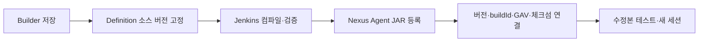

# Agent Playground 컴포넌트 구현 작업 초안

> 목적: Builder·Definition·Stage Runner 설계를 통합해 구현 티켓과 인수조건을 정의한다.
> 상태: MVP 범위·계약·일정을 재검토한 초안. 역할 A·B·C와 일정은 실제 담당자 배정 전 가안이다.
> 작성일: 2026-10-05. 수정일: 2026-10-06.
> 기준 문서: [Builder MVP 설계](agent-builder-design.md), [Definition MVP 설계](agent-definition-design.md), [Stage Runner MVP 설계](agent-stage-runner-design.md).
> 사용자 관점 참고: [사용자 시나리오](agent-playground-user-scenarios.md).

**편집 저장 → 소스 버전 고정 → Jenkins 빌드·검증 → Nexus Agent JAR 등록 → Stage Runner 반영**을 MVP 필수 경로로 한다. Runner와 적용 서비스는 같은 등록 JAR와 SDK를 사용한다. 빌드 중 기존 대화를 유지하며 새 버전은 수정본 테스트에서 빈 세션으로 전환한다. 파일럿 작업은 별도 묶음이다.

## 책임과 범위

| 컴포넌트 | 담당 | 이번 구현에서 맡지 않는 작업 |
| --- | --- | --- |
| SDK | LangGraph4j의 얇은 어댑터, 진입점·세션·공통 노드·Java 코드 노드·환경 연결 | 플랫폼 저장·버전 관리, editor/flow.json 해석, 독자 그래프 엔진 |
| Builder | 기존 Flowise 기반 프로토타입 재사용, 편집·그래프 검사·Java 코드 생성·오류 위치 표시 | 코드 실행, 버전 저장, 전체 Java 편집·역변환 |
| Definition 모듈 | 소유자 확인, 편집본 저장, 저장 순번 충돌, 고정 코드베이스 조회 | 그래프 검사·코드 생성, 독립 서버, 실행 DSL |
| Jenkins Agent CI | 고정 소스·SDK 컴파일·검증·JAR 게시 | 사용자 빌드 스크립트·운영 서비스 배포 |
| Runner 실행 어댑터 | 등록 JAR·SDK 검사·open/invoke·결과 전달 | 소스 재컴파일·재생성, 버전 저장 |
| Runner 제어 서비스 | 준비된 JAR 선택·전달·세션·컨테이너·메시지·정리 | 그래프 생성, SDK 대화 상태의 영구 보관 |
| 테스트 채팅 UI | Builder 화면의 별도 시험 패널 | Builder 제작 대화와 시험 대화의 혼합, 과거 대화 조회 |
| 인수 개발자 | 산출물의 서비스 저장소 반영·통합 검증·기존 CI/CD 배포 | Playground를 통한 운영 서비스 자동 배포 |

세 설계에서 명시한 MVP를 기본 범위로 삼는다. 기존 삭제 요청 AP-01·03·21·23·22·11·04·28 중 승인·조사·KPI·공유·별도 KPAP 확장·제공 준비 작업은 재등록하지 않는다. 설계의 ZIP 다운로드는 AP-22 삭제 요청에 따라 작업 목록과 합계에서 제외한다. 파일럿은 수동 고정 파일 전달로 검증한다.

새 요구는 일반 DSL 제작이 아니라 Java 코드베이스 제작이다. 이전의 CCAB 별도 연계 티켓은 제거하고, Builder 설계가 지정한 프로토타입의 자연어 편집과 캔버스를 재사용한다. Flowise 원본 실행 서버는 설치하지 않는다.

## A B C 역할과 협업 경계

기존 역할 분담에 Jenkins·Nexus 경로를 추가한다. 플랫폼 자체의 CI와 편집된 Agent 라이브러리의 CI는 별개다.

| 역할 | 중심 책임 | 중요한 티켓·작업 | 작업량 |
| --- | --- | --- | ---: |
| A · SDK·생성·등록 연결 | SDK 실행 의미, 코드 생성·고정, Jenkins 빌드 템플릿과 등록 결과 연결 | SDK-01~04, BLD-05, DEF-02, **CI-02·03**, TOOL-01, CTL-03, PIL-03 지원 | 28인일 |
| B · 저장·빌드 요청·Stage | 저장 후 Jenkins 요청, 등록 JAR 준비, 세션·호출·격리 | DEF-01, **CI-01**, RT-01~03, CTL-01·02·04, VAL-02 | 27인일 |
| C · 편집·CI 상태·시험 UI | 본문·자연어·그래프 검사, 빌드 상태·CI 진단, 시험 채팅과 전체 검증 | BLD-01~04·06, WEB-01·02, DEV-01, VAL-01, PIL-03 | 27인일 |
| 업무 담당자 | 파일럿 사례·기존 코드와 도구 구성 | PIL-01·02 | 4인일 |

| 경계 | 전달 계약 | 책임 |
| --- | --- | --- |
| 저장 → Jenkins 요청 | agentId·savedRevision·versionId·sdkVersion·buildId | B가 저장 성공 후 요청·전달 실패를 관리한다. Definition의 고정 소스만 요청한다. |
| Jenkins → Nexus | 플랫폼 고정 작업이 만든 Agent JAR·불변 GAV·SDK 버전 | A가 고정 빌드·검증·게시를 구성한다. 사용자 POM·빌드 스크립트를 실행하지 않는다. |
| Nexus/CI 결과 → Definition | 인증된 buildId·versionId·artifactRef·SHA-256·진단 | A가 실제 게시 산출물과 요청을 확인하고 READY를 연결한다. UI가 임의 성공 상태를 쓰지 않는다. |
| Definition → Runner | READY 버전의 정확한 JAR 좌표·SDK·체크섬 | B가 받아 검증하고 컨테이너에 JAR를 전달한다. 런타임에서 재컴파일하지 않는다. |
| Jenkins·Runner → Builder | 빌드 단계·시험 단계·오류·고정 진단 매핑 | C가 컴파일 실패와 시험 실패를 구분한다. 새 CI 성공으로 기존 대화를 자동 교체하지 않는다. |
| B ↔ A | 같은 세션 상태·슬롯·컨테이너 표식 | B의 생성·호출과 A의 종료·정리가 같은 상태를 사용한다. |

## 산정과 일정 가정

- **1 SP = 1인일.** 해당 작업의 구현과 기본 개발 검증을 포함한다. 여러 컴포넌트의 통합·장애·성능 검증은 VAL 티켓으로 별도 산정한다.
- 개발자 3명, 10월 12일 착수, 11월 24일 파일럿 검증 완료, 11월 26일 결함 수정 포함 완료를 목표로 한다. Jenkins·Nexus 준비와 빌드 지연은 확인 전이다. 모든 완료일시는 **2026년 한국시간 18:00** 기준의 가안이다.
- 기존 Jenkins·Nexus·저장소·인증·LLM 및 시험 도구 Gateway·컨테이너 생성과 종료 기반을 사용할 수 있다고 가정한다. 신규 인프라·업무 API 개발은 제외한다.
- Agentflow 패키지는 프로토타입의 현재 버전으로 고정하고, Java 17·SDK 한 버전·고정 이미지 하나를 지원한다.
- 선행 열은 계약 선공유와 구현 완료 의존성을 구분한다. WEB·CTL 병렬 개발은 먼저 공유한 API와 대역을 사용하며, 상대 컴포넌트 구현 이전에는 통합 완료로 판정하지 않는다. 아래 역할별 작업일 배정으로 중복 투입을 확인했다. 실제 담당자 배정은 아직 필요하다.
- ID는 아직 Jira에 등록하지 않은 초안 식별자다. 기존 ID를 가능한 유지하되 제목·내용은 이번 설계 기준으로 교체한다.

## Agent SDK

실행 계약은 SDK 구현 티켓 안에서 구체화한다. 별도 규격 합의 티켓은 만들지 않는다. 제안된 메서드명은 실제 구현에서 같은 역할을 갖도록 확정한다.

| ID / 제목 | 목적 | 구현 내용 | 인수조건 | SP | 완료일시 | 선행 / 시나리오 |
| --- | --- | --- | --- | --- | --- | --- |
| SDK-01 · 진입점·세션·그래프 실행 API 구현 | 생성 코드와 서비스의 공통 실행 기반 제공 | AgentProgram·AgentSession·AgentNode·AgentReply 계약과 LangGraph4j 직렬·조건 분기 어댑터를 구현한다. 진입점의 무인자 생성자·open·invoke를 지원한다. | 공개 API는 사내·JDK 타입만 사용한다. Java 17에서 코드를 로드하고 open 후 invoke한다. editor/flow.json 없이 실행하며 순환·병렬을 지원 범위에 넣지 않는다. | 3 | 10/14 18:00 | —; 10/12 최소 인터페이스 선공유 / C-03, D-02 |
| SDK-04 · MVP 공통 노드와 대화 상태 구현 | Builder가 생성하는 흐름의 의미 고정 | Start·LLM·Agent·Function·Condition·Reply 실행 의미, request·previous.output 참조, 직전 결과 전달, 분기 합류, Agent 도구 반복 제한을 구현한다. | Condition 동등 비교와 선택 경로의 결과가 일치한다. 노드 입력은 읽기 전용이고 결과는 JSON 값 Map이다. 두 턴 대화 이력은 이어지되 임시 노드 결과는 다음 턴에 남지 않는다. 코드 노드 일반 예외는 실행 오류로 반환한다. | 4 | 10/23 18:00 | SDK-01 / C-02~04, D-03 |
| SDK-02 · 환경 연결과 시험 어댑터 구현 | 실행 코드와 환경별 설정 분리 | AgentEnvironment로 LLM·도구 연결을 주입한다. 기존 Gateway 최소 어댑터와 호출 요약·실패 형식을 제공한다. 자격증명은 환경 연결에만 둔다. | 같은 코드에서 Stage·서비스 연결 구현을 교체한다. 허용한 조회·모킹만 사용하고 자격증명이 생성 코드에 없다. Agent 도구 반복 상한을 검증한다. | 3 | 10/19 18:00 | SDK-01 / C-03·04, D-02·03 |
| SDK-03 · Java·Kotlin 내장 실행 샘플 검증 | 인수 개발자의 적용 경로 확인 | Java·Kotlin의 최소 호출 예제와 산출물 교체 절차를 제공한다. 파일럿의 JDK 17·SDK 한 버전·목적 서비스 조합만 검증한다. | Runner와 두 언어의 최소 예제에서 같은 분기·코드 결과·두 턴 의미를 확인한다. Spring에 의존하는 API가 없다. 광범위한 Spring·JDK·라이브러리 호환성 매트릭스는 만들지 않는다. | 2 | 11/09 18:00 | SDK-01·02·04, BLD-05; 등록 JAR 최종 확인은 PIL-03 / D-01~04 |

DB 저장·DataSource·체크포인트·승인 재개는 이번 SDK에 넣지 않는다. 서비스가 수정한 코드를 Builder에 자동 역반영하지 않는다.

## Agent Definition 모듈

기존 플랫폼 백엔드와 저장소 안에 구현한다. 편집본 저장에서는 그래프의 실행 가능 여부를 검사하지 않는다.

| ID / 제목 | 목적 | 구현 내용 | 인수조건 | SP | 완료일시 | 선행 / 시나리오 |
| --- | --- | --- | --- | --- | --- | --- |
| DEF-01 · 편집본 생성·조회·저장과 순번 충돌 구현 | 미완성 작업을 보존하고 저장 충돌 방지 | 편집본·서버 순번을 저장한다. 저장 성공과 해당 순번의 빌드 요청 메타데이터를 기존 저장소에 함께 기록하고 CI-01이 처리하도록 한다. 입력 형식·상대 경로·크기·소유자·순번을 검사한다. | 미완성 그래프·본문을 저장·재조회한다. 소유자·경로·크기·순번 오류 및 부분 저장을 방지한다. 성공은 새 순번을 반환하고 실패는 기존 전체 저장본을 유지한다. | 3 | 10/14 18:00 | — / C-01·02 |
| DEF-02 · 코드베이스 원자적 고정·조회와 요청 중복 처리 | 생성 결과와 원본을 불변 버전으로 전달 | 저장 완료에 연결된 순번의 그래프·노드 파일을 Builder 검사·생성으로 전달하고 불변 소스 버전·진단 매핑을 고정한다. CI 빌드와 등록 JAR의 메타데이터를 그 버전에 연결할 저장 계약을 제공한다. | 실패·순번 변경에는 버전을 만들지 않는다. 소유자·에이전트 범위에서 같은 요청 ID·입력은 같은 버전, 다른 입력은 충돌이다. 고정된 코드·원본·진단 매핑은 이후 편집·컴파일 실패로 바뀌지 않는다. | 3 | 11/05 18:00 | DEF-01, BLD-04·05 / C-03·05, D-01 |

agent.json에는 진입점과 고정 SDK 버전만 둔다. 플랫폼 ID·소유자·순번·자격증명을 넣지 않는다. 저장된 버전 조회는 Runner에 고정 코드를 전달하며 재생성하지 않는다.

## Agent Builder

기존 캔버스·노드 설정·자연어 변경안 적용 및 취소·작업 기록을 재사용한다. 새로운 에디터를 처음부터 만들거나 별도 CCAB 경로를 동시에 개발하지 않는다.

| ID / 제목 | 목적 | 구현 내용 | 인수조건 | SP | 완료일시 | 선행 / 시나리오 |
| --- | --- | --- | --- | --- | --- | --- |
| BLD-01 · 프로토타입 노드와 Java 메서드 본문 편집 전환 | 기존 제작 화면을 Java 코드베이스에 맞춤 | Start·LLM·Agent·Function·Condition·Reply 설정을 적용한다. Function을 고정 서명·패키지·import의 Java 본문 편집으로 전환한다. 안정적인 노드 ID·파일 경로를 연결한다. | 고정 템플릿의 본문만 편집한다. 본문은 Java 파일 하나에 존재한다. 그래프 재생성으로 본문이 사라지지 않는다. 노드 삭제 시 연결·참조·파일을 함께 제거하며 생성 클래스·진입점은 편집하지 않는다. | 4 | 10/20 18:00 | SDK 최소 계약, DEF-01 / C-01·02 |
| BLD-02 · 자연어 변경 도구와 오래된 변경안 차단 | 기존 자연어 편집을 MVP 범위에 맞춤 | Java 본문 생성·변경 규칙과 Condition true·false 포트 선택을 추가한다. 노드·연결·본문 전후 검토, 적용·취소, 화면 변경 순번 검사를 구현한다. API 소유자·모델·도구와 요청 제한을 적용한다. | 선택한 분기 포트가 정확하다. 오래된 변경안은 적용하지 않는다. 적용 전 제안·취소는 저장·시험에 반영되지 않는다. 요청 6,000자·응답 반복 10회·기본 120초 제한이 동작한다. | 3 | 10/28 18:00 | BLD-01 / C-01·02 |
| BLD-03 · 서버 저장 UI와 편집·저장 상태 구현 | 화면 편집과 시험 기준 저장본 구분 | Definition API에 연결한다. 변경 있음·저장 중·완료·실패를 표시하고 서버 저장 순번을 유지한다. 브라우저 저장은 복구 보조로만 쓴다. | 저장 중 추가 편집을 이전 응답으로 지우지 않는다. 저장 성공과 CI 성공을 구분한다. 미완성 저장은 허용하고 검사·빌드 오류를 표시한다. 빌드 중 현재 시험 대화를 종료하지 않는다. | 3 | 10/23 18:00 | DEF-01, BLD-01 / C-01~03 |
| BLD-04 · 빌드 전 그래프·상태 참조 검사 구현 | 실행 불가능한 흐름의 코드 생성 방지 | 기존 프로토타입 형식과 10/12 노드·파일 계약으로 독립 검사 함수를 만든다. Start 하나, 일반 연결 하나, Condition 두 포트, Reply 종료, 코드 파일·템플릿·참조 형식, 순환·끊김·미도달을 검사한다. | 지원 그래프는 통과하고 잘못된 노드·포트·파일·고정 템플릿 변경은 위치 오류로 거절한다. 임의 Java 결과 필드를 정적으로 추론하거나 문법을 컴파일하지 않는다. 편집본 저장에서는 강제하지 않는다. | 2 | 10/13 18:00 | 10/12 최소 계약·프로토타입 형식 / C-02·04 |
| BLD-05 · 서버 Java 구성 코드와 코드베이스 생성 구현 | 저장한 그래프를 유일한 실행 코드로 변환 | 저장된 동일 순번의 그래프·노드 파일에서 agent.json·Java 구성 코드를 생성하고 nodeId·file·본문 시작 행 매핑을 반환한다. 서버 생성 결과만 고정하며 사용자 노드 본문은 덮어쓰지 않는다. | 브라우저 생성 코드를 실행 기준으로 사용하지 않는다. true·false 경로와 SDK 입력 전달 의미가 일치한다. 본문을 덮어쓰지 않는다. 서버 생성 코드만 Definition 고정 대상으로 전달한다. | 3 | 11/02 18:00 | SDK-01·04, BLD-04 / C-03, D-01~03 |
| BLD-06 · 준비 오류의 노드·본문 행 번호 연결 구현 | 생성 틀을 몰라도 오류 수정 가능 | Jenkins 컴파일 진단의 파일·행과 고정 소스 버전 매핑으로 본문 행을 보정한다. Runner의 JAR 로딩·open·invoke 오류는 별도 시험 오류로 표시한다. | 알려진 Java 문법 오류가 올바른 노드·본문 행에 표시된다. 사용자가 고친 뒤 새 버전으로 시험한다. 그래프 검사·파일 오류·위치 불명 오류를 구분한다. | 2 | 11/12 18:00 | BLD-05, CI-02·03, RT-03; 11/06·09 대역 개발 후 통합 / C-04 |

화면 변경 순번은 변경안 적용의 기준이고 서버 저장 순번은 저장·고정 충돌의 기준이다. 둘을 같은 값으로 취급하지 않는다. 패키지·템플릿 비호환 편집본을 조용히 변환하지 않고 오류를 표시한다.

## Jenkins Agent CI와 Nexus 등록

플랫폼 CI와 구분되는 Agent 코드 빌드 경로다. 기존 Jenkins와 Nexus를 사용한다. Nexus Maven 저장소 유형을 전제로 하며 실제 repositoryId·GAV 규칙·Jenkins job·credential ID는 운영 설정을 확인한다.

| ID / 제목 | 목적 | 구현 내용 | 인수조건 | SP | 완료일시 | 선행 / 시나리오 |
| --- | --- | --- | --- | --- | --- | --- |
| CI-01 · 저장 완료의 Jenkins 빌드 요청 연결 | 변경 코드를 등록 파이프라인에 자동 전달 | 저장 순번 기반 빌드 요청을 기록·처리한다. Builder 생성·Definition 고정 후 불변 소스 versionId·sdkVersion·buildId로 Jenkins 고정 job을 요청한다. 전달 실패·중복·수동 재요청을 처리한다. | 미완성 저장은 성공하되 생성 실패를 표시한다. 유효한 저장본은 Jenkins 요청으로 연결된다. 중복 요청이 다른 소스를 빌드하지 않고 전달 실패가 사라지지 않는다. | 3 | 10/28 18:00 | DEF-01 계약·DEF-02 대역, CI-02; 10/22~26 개발 후 연결 / C-01~04 |
| CI-02 · Jenkins 고정 빌드·검증·Nexus JAR 등록 | 실행 가능한 라이브러리 발행 | 고정 소스·Java 17·SDK 한 버전으로 --release 17·-proc:none 컴파일·검증·JAR·게시를 수행한다. 고정 작업만 실행하고 불변 Maven 좌표·SHA-256·진단·buildId를 만든다. 게시 권한은 CI 게시 단계에 둔다. | 잘못된 Java·SDK 사용은 실패하며 READY로 등록되지 않는다. Agent JAR에 SDK·임의 라이브러리·자격증명을 넣지 않는다. 중복 게시가 성공 산출물을 덮어쓰지 않는다. 실제 Nexus 등록·조회로 확인한다. | 3 | 10/28 18:00 | SDK-01·04, 기존 Jenkins·Nexus·고정 소스 예제 / C-03·04, D-02 |
| CI-03 · 인증된 빌드 결과와 Nexus 산출물 연결 | 게시 성공한 정확한 버전만 Stage에 제공 | 기존 CI 상태 조회 또는 인증된 결과 통지로 buildId·source version·SDK·GAV·체크섬·진단을 확인한다. Nexus 실제 등록물을 검증하고 Definition 메타데이터에 READY 또는 실패를 기록한다. | 위조·불일치·취소·오래된 결과를 거절한다. 등록 실패를 READY로 표시하지 않는다. 새 버전 준비가 기존 세션을 바꾸지 않고 Runner와 UI가 같은 불변 GAV를 받는다. | 2 | 11/12 18:00 | CI-01·02, DEF-02 / C-03~05, D-01·02 |

저장·source version·buildId·artifactRef를 구분한다. 버전 고정 성공은 컴파일 성공이 아니고 Nexus 등록 READY는 Runner 세션 준비 완료가 아니다. 새 저장본은 새 버전의 빌드를 요청하지만 같은 버전의 시험·새 대화는 빌드하지 않는다. Jenkins 재시도는 고정 소스만 사용하며 성공한 Nexus 버전을 덮어쓰지 않는다.

## Stage Runner 실행 어댑터

고정 소스 버전의 Jenkins 빌드가 Nexus에 게시한 Agent JAR가 실행 기준이다. 소스를 컴파일·재생성하지 않는다. 진입점 로딩·open도 컨테이너 안에서 수행한다.

| ID / 제목 | 목적 | 구현 내용 | 인수조건 | SP | 완료일시 | 선행 / 시나리오 |
| --- | --- | --- | --- | --- | --- | --- |
| RT-01 · 고정 이미지와 Agent JAR 로딩 검사 구현 | CI가 게시한 라이브러리로 실행 환경 준비 | 고정 JDK 런타임·SDK·어댑터 이미지에서 전달된 Agent JAR의 manifest·SDK·진입점 계약을 검사한다. JAR 클래스패스로 로딩하며 src를 컴파일하지 않는다. | SDK·진입점 불일치를 거절한다. 사용자 코드 로딩은 컨테이너 안에서 수행한다. Runner에 Maven·Gradle·javac 실행과 게시 자격증명이 없다. | 2 | 10/16 18:00 | SDK 최소 타입·고정 예제 JAR; 실제 Nexus 연결은 CTL-01 / C-03·04 |
| RT-02 · 진입점 open·다중 턴 invoke와 요청 기록 구현 | 고정 코드의 대화를 같은 JVM에서 유지 | 무인자 진입점 생성 후 open으로 세션을 만든다. invoke를 순서대로 호출하고 요청 ID·입력·진행 상태·결과를 활성 세션 동안 기록한다. | 진입점은 AgentProgram과 무인자 생성자 계약을 지킨다. open은 빈 상태, invoke는 같은 상태에서 순차 실행한다. 같은 ID·입력은 기존 결과, 다른 입력은 충돌이다. 사용자 코드의 로딩·open·invoke는 모두 컨테이너 안에 둔다. | 3 | 11/02 18:00 | RT-01, SDK-02·04 / C-03·04 |
| RT-03 · 답변·도구 요약·준비 및 실행 오류 응답 구현 | 제어 서비스와 UI에 일관된 결과 전달 | versionId·buildId·sessionId·requestId와 단계·오류 코드·답변·도구 요약을 구조화한다. 로딩·open·invoke 실패를 전달한다. CI 컴파일 오류를 런타임 오류로 대신 처리하지 않는다. | SDK 불일치·JAR 로딩·open·invoke·시간 초과 오류를 구분한다. 컴파일 오류는 Jenkins 경로로만 전달한다. UI·일반 로그에 자격증명이 없다. 답변 완료 후 반환하며 스트리밍·전체 노드 추적을 요구하지 않는다. | 3 | 11/05 18:00 | RT-01·02 / C-03·04 |

## Stage Runner 제어 서비스

초기 인스턴스 하나로 운영한다. 버전 고정 전 실패와 고정 성공 후 준비 실패의 처리 차이를 명시한다.

| ID / 제목 | 목적 | 구현 내용 | 인수조건 | SP | 완료일시 | 선행 / 시나리오 |
| --- | --- | --- | --- | --- | --- | --- |
| CTL-01 · 등록 JAR 준비·중복 제어·컨테이너 생성 구현 | 한 시험 요청에서 버전과 세션 중복 생성 방지 | READY 버전의 Nexus GAV·체크섬·SDK를 조회하고 등록 JAR를 받아 검사한다. 사전 확인 성공 후 기존 세션을 종료하고 컨테이너에 검증된 JAR·시험 환경을 전달한다. 준비 요청 중복·슬롯을 관리한다. | 미등록·실패 빌드·SDK·체크섬 불일치·다운로드 실패에는 기존 세션을 유지한다. 그 이후 컨테이너·open 실패는 새 자원을 정리한다. latest·SNAPSHOT으로 선택하지 않는다. JAR를 다시 컴파일하지 않는다. | 5 | 11/12 18:00 | DEF-02, CI-03, RT-01, CTL-04; 연계 대역으로 병렬 개발 / C-03·04 |
| CTL-02 · 메시지 직렬·중복·입력 충돌 처리 구현 | 한 메시지의 중복 실행과 무단 재시도 방지 | UI 요청 ID를 세션 범위로 관리한다. 같은 ID의 재전송은 상태·결과를 반환하고 다른 입력은 거절한다. 별도 새 메시지는 실행 중 BUSY로 거절하며 큐에 넣지 않는다. 자동 재실행하지 않는다. | 중복 invoke가 없고 입력 충돌·BUSY는 기존 실행을 중단하지 않는다. invoke 오류·시간 초과·결과 불명은 세션을 종료한다. 폐기된 세션의 지연 결과는 현재 세션에 표시하지 않는다. | 3 | 11/17 18:00 | CTL-01, RT-02·03 / C-03·04 |
| CTL-03 · 세션 전환·시간 제한·장애·재시작 정리 구현 | 수명 종료와 임시 자원 제거 | 새 대화·수정본 테스트·사용자 종료·유휴 만료·장애·배포 종료를 처리한다. 컨테이너 관리 표식과 임시 파일을 관리하고 시작 시 잔여 자원을 정리한다. | 새 대화는 같은 버전, 수정본 시험은 새 버전이다. 준비 180초·invoke 120초·유휴 30분 제한을 조정한다. 종료 요청을 반복해도 자원·슬롯을 한 번만 반환한다. 관리 표식 범위의 컨테이너·파일만 정리하고 대화를 복원하지 않는다. | 3 | 11/17 18:00 | CTL-01; CTL-02와 병렬 구현 후 통합 / C-03·04 |
| CTL-04 · 요청 소유자·시험 권한·컨테이너 제한 적용 | 사용자 코드와 세션의 접근 범위 제한 | 기존 인증과 요청별 버전·세션 소유자를 검사한다. 비특권 계정·CPU·메모리·프로세스·통신 제한과 세션 시험 권한을 적용한다. | 사용자별 활성 세션 하나, 다른 사용자 컨테이너 분리가 지켜진다. 호스트 폴더·관리 소켓·플랫폼 DB·운영 자격증명이 노출되지 않는다. 필요한 LLM·시험 Gateway만 접근한다. | 3 | 10/21 18:00 | DEF-01, RT-01 / C-03, D-03 |

Definition의 버전 고정 요청 ID, Runner의 준비 요청 ID, 세션 메시지 요청 ID는 용도와 유효 범위를 구분한다. 이 중복 제어는 실제 결제 작업의 멱등성 기능을 대체하지 않는다.

## Playground 테스트 채팅 UI

Runner 계약을 따르는 Builder의 별도 패널이다. 제작 대화와 시험 대화를 구분한다. 컴파일 오류 위치 보정은 BLD-06에서 담당하므로 중복 산정하지 않는다.

| ID / 제목 | 목적 | 구현 내용 | 인수조건 | SP | 완료일시 | 선행 / 시나리오 |
| --- | --- | --- | --- | --- | --- | --- |
| WEB-01 · 준비 상태·시험 헤더·메시지·실행 상세 구현 | 제작한 에이전트를 별도 대화로 시험 | 저장 순번의 Jenkins 준비·대기·빌드·Nexus 등록·READY·실패 상태와 Runner 준비 상태를 분리한다. CI 진단·버전·buildId·시험 헤더·메시지·답변을 표시한다. | 해당 저장본의 라이브러리 READY 전 새 시험을 막는다. 새 빌드 중 기존 대화는 유지한다. 늦은 이전 빌드·세션 응답을 최신 상태로 표시하지 않는다. 메시지 재전송은 같은 ID를 쓴다. | 4 | 11/17 18:00 | CI-01~03, BLD-03, CTL-01·02; 11/10~13 개발 후 통합 / C-03·04 |
| WEB-02 · 편집 변경 표시·새 대화·수정본 테스트·종료 연결 | 편집본과 시험 버전의 반영 시점 구분 | 편집 변경 표시와 서버 저장 확인, 세션 전환·종료·장애 알림을 연결한다. 새 세션의 이전 화면 대화를 비운다. | 저장이나 CI 성공만으로 현재 세션을 바꾸지 않는다. 사용자가 수정본 테스트를 누르면 준비된 정확한 새 JAR로 빈 세션을 연다. 새 대화는 같은 JAR를 사용한다. 실행 중 교체는 막고 종료는 허용한다. | 2 | 11/17 18:00 | WEB-01, CTL-03; 병렬 개발 후 통합 / C-02~04 |

기존 WEB-03의 실행 상세는 WEB-01, 코드 오류 위치 표시는 BLD-06으로 합쳤다. 과거 대화 보관·조회, 버전 간 비교, 전체 노드 실행 시각화는 제외한다.

## 시험 도구 연결

SDK-02는 연결 인터페이스·어댑터 코드를 담당한다. 아래 티켓은 Stage의 실제 시험 설정·권한·모킹 응답 연결을 담당한다.

| ID / 제목 | 목적 | 구현 내용 | 인수조건 | SP | 완료일시 | 선행 / 시나리오 |
| --- | --- | --- | --- | --- | --- | --- |
| TOOL-01 · Stage 조회·모킹 도구 설정과 호출 검증 | 운영 쓰기 없이 실제 연결 확인 | SDK-02의 기존 Gateway 어댑터에 파일럿의 허용 모델·조회·모킹 설정만 연결한다. 실제 호출과 시험 헤더를 확인한다. 도구 선택 UI는 BLD-01, 모킹 데이터는 PIL-01에서 제공한다. | 버전에 지정한 허용 도구와 세션 환경·헤더가 일치한다. 실제 쓰기 호출을 할 수 없다. 신규 카탈로그·도구 관리·모킹 서비스를 구축하지 않는다. | 1 | 11/10 18:00 | SDK-02, BLD-01, CTL-04 / C-03·04, P-01~03 |

도구 카탈로그 검색·등록·신규 결제 API 개발·별도 KPAP 확장은 포함하지 않는다.

## 빌드와 Stage 배포

| ID / 제목 | 목적 | 구현 내용 | 인수조건 | SP | 완료일시 | 선행 / 시나리오 |
| --- | --- | --- | --- | --- | --- | --- |
| DEV-01 · Builder·SDK·Runner 빌드와 기존 Stage 배포 연결 | 고정 버전의 구현물을 함께 발행 | 기존 플랫폼 CI에 Builder·SDK·런타임 이미지 빌드·발행과 Stage 배포를 연결한다. Agent별 Java 변경 빌드·Nexus 게시 작업은 CI-01~03에서 따로 구현한다. | 플랫폼·SDK·런타임 이미지 버전이 식별된다. Agent 저장으로 플랫폼 이미지를 다시 빌드하지 않는다. 런타임 이미지와 Agent JAR의 발행 경로를 구분한다. | 2 | 10/30 18:00 | SDK-04, RT-01; 플랫폼 CI만 담당 / C-03, D-02 |

## 플랫폼 통합 검증

각 컴포넌트의 기본 개발 검증과 구분해 경계·동시성·실패 경로를 확인한다. 사용자용 테스트 사례 관리·자동 회귀 검증 제품은 만들지 않는다.

| ID / 제목 | 목적 | 구현 내용 | 인수조건 | SP | 완료일시 | 선행 / 시나리오 |
| --- | --- | --- | --- | --- | --- | --- |
| VAL-01 · 편집·생성·고정·대화의 통합 및 장애 검증 | 세 설계의 계약이 전체 흐름에서 지켜지는지 확인 | 저장→고정→Jenkins→Nexus→정확한 JAR 로딩→두 턴을 통합 검증한다. 빌드·등록·다운로드·SDK·체크섬 실패, 중복·위조·늦은 CI 결과, 버전 전환·세션 정리를 확인한다. | 실패 빌드를 READY로 표시하지 않고 이전 세션을 잘못 교체하지 않는다. CI 성공 후 수동 전환·고정 JAR 일치·두 사용자 분리·중복 invoke 방지·종료 후 자원 없음이 확인된다. | 3 | 11/20 18:00 | DEF-02, BLD-02~06, CI-01~03, CTL·RT·WEB 구현, DEV-01 / C-01~04 |
| VAL-02 · 파일럿 코드 준비 시간과 세션 용량 검증 | 요청 시 생성 방식이 MVP 목표를 충족하는지 측정 | 실제 파일럿의 저장→고정→Jenkins 대기·컴파일→Nexus 등록 시간과 시험 요청→JAR 확보·open 시간을 각각 측정한다. 세션 용량 상한도 확인한다. | CI·등록 시간을 제외해 180초 목표를 달성했다고 판정하지 않는다. 시스템 준비 합계·각 단계·성공/실패·사용자 대기를 구분해 기록한다. 지연 원인이 있으면 Jenkins 용량·경로와 목표를 재검토한다. | 2 | 11/19 18:00 | CI-01~03, CTL-01·03, PIL-02 / C-03 |

준비 180초와 메시지 실행 120초를 구분한다. 30초 목표·준비 풀·컴파일 캐시는 필수 완료조건에 넣지 않는다. 실측에서 180초를 충족하지 못할 때만 추가 범위를 검토한다.

## 서브 결제 파일럿

운영 결제·환불 처리와 대고객 공개를 포함하지 않는다. 아래는 플랫폼 제작·시험·서비스 내장 적용을 확인하는 별도 업무 묶음이다.

| ID / 제목 | 목적 | 구현 내용 | 인수조건 | SP | 완료일시 | 선행 / 시나리오 |
| --- | --- | --- | --- | --- | --- | --- |
| PIL-01 · 파일럿 시나리오·입력·기대 결과 구성 | 판정 기준과 시험 데이터 준비 | 정상·입력 누락·조건 불충족·도구 실패·시간 초과와 두 턴 대화 사례를 작성한다. 기대 분기·답변·도구 결과와 모킹 데이터를 업무 담당자와 정한다. | 각 사례를 조회·모킹으로 반복 시험하고 업무 담당자가 결과를 판정할 수 있다. 실제 결제·환불을 발생시키지 않는다. | 2 | 10/13 18:00 | — / P-01~03 |
| PIL-02 · 서브 결제 편집 그래프·Java 본문·시험 도구 구성 | 성능과 업무 검증용 실제 산출물 확보 | 제작자가 기존 샘플 본문·허용 시험 설정을 재사용해 업무 그래프를 구성한다. 별도 도구·Java 기능 개발 없이 UI 통합과 병렬로 실제 파일럿 버전을 준비한다. | 고정 버전으로 두 턴·정상·예외·실패 사례를 수행한다. 생성 분기·본문 결과·시험 설정이 기대와 일치한다. 코드 변경이 필요하면 해당 개발 작업으로 별도 산정한다. | 2 | 11/17 18:00 | BLD-01~05, CI-01~03, TOOL-01, WEB-01·02 / C-01~04, P-01~03 |
| PIL-03 · 제작자 작업과 개발자 내장 적용 검증 | 제작에서 서비스 통합까지 확인 | 비개발자의 편집·저장·CI 오류 수정·재빌드·수정본 시험을 관찰한다. 개발자는 같은 Nexus JAR·SDK를 서비스에 적용하고 새 등록 버전으로 교체한다. | Jenkins·Nexus·Runner·서비스의 versionId·JAR·SDK와 분기·본문·두 턴 의미가 일치한다. 별도 재구현이나 사용자 ZIP 없이 적용한다. 차단 결함을 해결하거나 범위·일정을 재조정한다. | 3 | 11/24 18:00 | PIL-02, SDK-03, VAL-01·02; 동일 Nexus Agent JAR / C-01~05, D-01~04 |

PIL-03의 기본 인계 경로는 **같은 Nexus Agent JAR·SDK의 서비스 적용**이다. 필요하면 고정 소스도 기존 저장소에서 수동 전달한다. 사용자 ZIP·공유 기능은 추가하지 않는다.

## 이번 변경의 계약과 범위

| 경계 | 필수 계약 |
| --- | --- |
| 저장 → 고정·Jenkins | 저장 성공 후 빌드 요청을 잃지 않는다. 같은 순번의 그래프·노드 파일을 읽어 검사·생성·원자적 고정한다. 오래된 순번은 거절하며 성공 저장·실패 빌드를 구분한다. |
| Jenkins → Nexus | 플랫폼 고정 Java 17·SDK·빌드 작업만 사용한다. 불변 GAV와 JAR 체크섬으로 게시한다. SDK는 별도 제공하고 사용자 외부 의존성·스크립트·비밀정보를 넣지 않는다. |
| CI 결과 → Definition | 버전·buildId·SDK·등록 좌표·체크섬을 인증된 경로로 연결한다. Registry 실제 산출물 확인 후 READY를 기록한다. 이전 빌드의 늦은 결과가 최신 저장본 상태를 덮어쓰지 않는다. |
| Definition → Runner | 현재 시험 요청의 READY 산출물 좌표만 선택한다. latest·SNAPSHOT·사용자 임의 URL을 받지 않는다. 다운로드·SDK·체크섬 확인 전 기존 세션을 닫지 않는다. |
| Runner → 세션 | 검증된 JAR를 새 컨테이너에서 로딩·open한다. 코드 변경 저장·빌드 성공은 현재 세션에 반영하지 않는다. 수정본 테스트에서 빈 새 세션으로 전환한다. |
| 컴파일 오류 → UI | CI 진단은 고정 소스 버전의 nodeId·파일·본문 시작 행 매핑으로 표시한다. Runner 로딩·open·invoke 오류와 구분한다. |
| 상태·시간 → UI | 저장 완료·Jenkins 대기/빌드/등록·라이브러리 READY·Runner 준비 완료를 구분한다. 이전 buildId·sessionId 응답을 최신 성공으로 처리하지 않는다. CI 대기 시간을 성능 평가에서 빼지 않는다. |
| Registry 권한 → 컨테이너 | Jenkins 게시 자격증명과 플랫폼 Registry 읽기 권한을 사용자 컨테이너에 주지 않는다. 검증된 JAR·시험 환경만 전달한다. |

기존 순번·변경안 충돌, nodeId/파일 연결, 중복 메시지, 자원·권한 제한과 종료 정리는 유지한다. SDK 공통 노드·직렬/조건 분기 의미도 변경하지 않는다.

Jenkins Agent CI·Nexus JAR 등록은 **이번 사용자 요구로 MVP에 추가**한다. 독립 Definition 서버·실행 DSL·사용자 POM·새 CI/Registry 구축·컴파일 캐시·준비 풀·분산 큐·체크포인트·승인 승격·실제 결제 쓰기·운영 자동 배포·ZIP·공유·과거 대화·자동 회귀 시험 관리 등은 계속 제외한다.

## 작업량과 일정 요약

| 묶음 | 티켓 수 | SP | 완료 목표 |
| --- | ---: | ---: | --- |
| Agent SDK | 4 | 12 | 11/09 |
| Agent Definition | 2 | 6 | 11/05 |
| Agent Builder | 6 | 17 | 11/12 |
| **Jenkins Agent CI·Nexus 등록** | **3** | **8** | **11/12** |
| Runner 실행 어댑터 | 3 | 8 | 11/05 |
| Runner 제어 서비스 | 4 | 14 | 11/17 |
| 시험 채팅 UI | 2 | 6 | 11/17 |
| 시험 도구 연결 | 1 | 1 | 11/10 |
| 플랫폼 빌드·Stage 배포 | 1 | 2 | 10/30 |
| 통합·성능 검증 | 2 | 5 | 11/20 |
| **플랫폼 소계** | **28** | **79** | **11/20** |
| **별도 파일럿** | **3** | **7** | **11/24** |
| **전체 구현·검증** | **31** | **86** | **11/24** |
| 수정 여유 | 티켓 미발행 | 6 | 11/25~26 |
| **여유 포함 계획** | **31** | **92** | **11/26** |

기존 77인일에 CI 8인일·JAR 준비 1인일·상태 UI 1인일을 추가하고 Runner 컴파일 제거로 1인일을 줄여 **86인일**이다. 기존 11/20 완료 가정은 CI 경로가 없는 계획이므로 유지하지 않는다. Jenkins·Nexus를 바로 활용할 수 있고 코드·시험 범위가 유지되는 경우 **11/26**을 새 가안으로 둔다. 실제 queue·빌드·게시 시간과 사내 접근 승인이 다르면 재산정한다.

### 역할별 작업일 배정

개발자 A·B·C 전일 투입과 별도 업무 담당자를 가정한다. 토요일·일요일을 제외하고 역할별 작업일을 겹치지 않게 배정한다. 계약·예제·대역을 사용한 병렬 개발의 완료와 실제 CI·Registry 통합 판정은 구분한다.

| 역할 | 작업일 배정 | 합계 |
| --- | --- | ---: |
| A | SDK-01 10/12~14 → SDK-02 10/15~19 → SDK-04 10/20~23 → CI-02 10/26~28 → BLD-05 10/29~11/02 → DEF-02 11/03~05 → SDK-03 11/06·09 → TOOL-01 11/10 → CI-03 11/11~12 → CTL-03 11/13·16·17 → PIL-03 지원 11/23 | 28인일 |
| B | DEF-01 10/12~14 → RT-01 10/15~16 → CTL-04 10/19~21 → CI-01 개발 10/22·23·26, 연결 판정 10/28 → RT-02 10/29~11/02 → RT-03 11/03~05 → CTL-01 11/06·09~12 → CTL-02 11/13·16·17 → VAL-02 11/18~19 | 27인일 |
| C | BLD-04 10/12~13 → BLD-01 10/15~20 → BLD-03 10/21~23 → BLD-02 10/26~28 → DEV-01 10/29~30 → BLD-06 개발 11/06·09, CI 연결 판정 11/12 → WEB-01 개발 11/10~13, 통합 11/17 → WEB-02 11/16~17 → VAL-01 11/18~20 → PIL-03 11/23~24 | 27인일 |
| 업무 담당자 | PIL-01 10/12~13 → PIL-02 11/16~17 | 4인일 |
| A·B·C | 각 11/25~26 수정 여유 | 6인일 |

CI-01과 CI-02는 고정 소스·인터페이스 예제로 먼저 구현한다. 실제 Builder 저장본과 고정 버전이 Jenkins·Nexus·READY로 이어지는 완료는 CI-03에서 확인한다. CI 결과 연계가 끝나기 전 미등록 파일럿을 완료로 판정하지 않는다.

### 착수·완료 조건

- 10/12에 최소 SDK·저장·빌드 요청·JAR 메타데이터 계약을 기존 티켓 안에서 공유한다.
- 10/15 전 Jenkins 실행 권한·고정 job, Nexus Maven 저장소·GAV 규칙·게시 및 읽기 credential ID, SDK 발행 경로를 확인한다. 비밀값을 문서나 사용자 코드에 넣지 않는다.
- 저장 이벤트·Jenkins job·Nexus 게시 연결은 신규 인프라 구축 없이 기존 운영 도구를 사용한다. 접근 지연이나 신규 설치는 현재 산정에 없다.
- CI 대기·컴파일·등록과 Stage JAR 준비를 함께 측정한다. CI 지연을 제외한 180초만으로 성능 목표 통과를 선언하지 않는다.
- 11/17 기능 통합, 11/20 기술 검증, 11/24 파일럿 검증, 11/26 수정 포함 완료를 목표로 한다. 차단 결함이 남으면 일정·범위를 조정한다.
