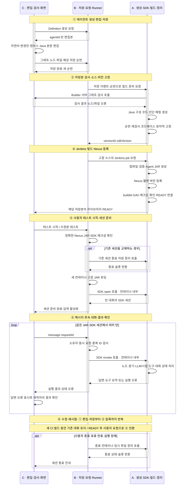

# 에이전트 제작 라이프사이클과 담당 구간

> 작성일: 2026-10-06.
> 목적: 에이전트 하나의 제작·빌드·시험 흐름을 컴포넌트 기능 순서로 보여주고 A·B·C의 구현 경계를 표시한다.
> 기준: [사용자 시나리오](agent-playground-user-scenarios.md), [구현 작업](agent-playground-implementation-tasks.md), [Builder](agent-builder-design.md), [Definition](agent-definition-design.md), [Stage Runner](agent-stage-runner-design.md).

이 문서의 시간축은 **에이전트 제작 시 동작 순서**다. 개발 일정이나 실제 처리시간을 뜻하지 않는다. A·B·C는 기능의 구현 담당이며 매번 사람이 수동으로 처리한다는 뜻이 아니다. 담당 레인은 독립 서버 배치를 뜻하지 않는다. Builder·Definition 모듈은 기존 백엔드에 있고 SDK는 Runner의 컨테이너 안에서 호출된다.

**C가 편집 → B가 저장 → C가 그래프 검사 → A가 생성·고정 → B가 Jenkins 요청 → A가 빌드·Nexus 등록·결과 연결 → B가 JAR 준비 → A의 SDK가 실행 → C가 결과 표시**하는 흐름이다.

## 타임라인과 담당 구간

정상 경로를 위에서 아래로 진행한다. 실패 경로는 아래 별도 표에 정리한다. 레인의 굵은 활성 막대는 해당 담당의 기능이 동작하는 구간이며 길이는 실제 소요시간·개발 인일을 의미하지 않는다.

①에서 ③까지는 저장 후 자동 경로다. **라이브러리 READY와 Runner 세션 준비 완료는 별개**다. ③이 성공해도 기존 대화를 자동 종료하지 않고, 사용자가 ④의 수정본 테스트를 요청해야 새 버전으로 전환한다.

## 기능 단위의 상세 순서

번호는 아래 표의 순서이며 실제 처리시간은 추정하지 않는다. 담당은 주 구현 담당이다. 전달·표시 기능은 다른 담당과 연결된다.

| 순서 | 제작자의 행동 또는 시스템 단계 | 컴포넌트 기능 | 담당·티켓 | 다음 단계로 전달하는 결과 |
| --- | --- | --- | --- | --- |
| 01 | 새 에이전트 생성 요청 | Builder 생성 화면 | C · BLD-03 | 이름·생성 요청 |
| 02 | 빈 편집본 생성 | Definition 생성·소유자 지정 | B · DEF-01 | agentId·빈 편집본 |
| 03 | 자연어·캔버스·본문 편집과 변경안 확인 | Builder 편집·적용·취소·오래된 변경안 차단 | C · BLD-01·02 | 적용한 그래프·노드 Java 파일 |
| 04 | 저장 버튼 클릭 | Builder 서버 저장 요청·미저장 상태 관리 | C · BLD-03 | agentId·예상 저장 순번·그래프·파일 |
| 05 | 편집본 보관 | Definition 소유자·파일·경로·크기·순번 검사와 전체 저장 | B · DEF-01 | savedRevision·저장 결과·빌드 요청 기록 |
| 06 | 저장 후 빌드 준비 | CI 연계가 해당 저장 순번의 고정 준비 요청 | B · CI-01 | agentId·savedRevision·요청 ID |
| 07 | 실행 가능한 그래프인지 검사 | Builder 서버 그래프·포트·코드 파일·참조 검사 | C · BLD-04 | 통과 또는 노드·파일 오류 |
| 08 | Java 구성 코드 생성 | Builder 생성 템플릿·본문 보존·진단 매핑 | A · BLD-05 | agent.json·구성 코드·nodeId/file/본문 행 매핑 |
| 09 | 소스 버전 고정 | Definition 순번 재검사·원자 저장·중복 고정 방지 | A · DEF-02 | 불변 versionId·SDK 버전·소스·매핑 |
| 10 | Jenkins 실행 요청 | CI 연계의 고정 job·입력 전달·중복 요청 관리 | B · CI-01 | buildId·고정 소스 버전·SDK 버전 |
| 11 | 컴파일·검증·패키징 | Jenkins 고정 Java 17·SDK 빌드·Agent JAR 생성 | A · CI-02 | Agent JAR 또는 컴파일 진단 |
| 12 | 사내 라이브러리 게시 | Jenkins 게시 단계의 Nexus 불변 GAV 등록 | A · CI-02 | artifactRef·SHA-256·게시 결과 |
| 13 | 성공한 산출물과 버전 연결 | CI 결과 인증·버전/SDK/buildId/Nexus 실제 산출물 확인 | A · CI-03 | 버전에 연결된 라이브러리 READY 또는 실패 |
| 14 | 빌드 상태·오류 확인 | Builder 빌드 상태·고정 버전의 본문 행 보정 | C · WEB-01·BLD-06 | READY이면 새 시험 허용, 실패면 수정 안내 |
| 15 | 테스트 시작 또는 수정본 테스트 | 시험 UI의 선택 버전·준비 요청 | C · WEB-01·02 | 정확한 READY versionId·준비 요청 ID |
| 16 | 실행할 JAR 확보 | Runner의 Nexus 조회·다운로드·SDK·체크섬 검증 | B · CTL-01 | 검증된 등록 JAR·세션 시험 설정 |
| 17 | 기존 시험 세션 교체 시 정리 | Runner 종료·슬롯 반환·자원 정리 | A · CTL-03 | 기존 컨테이너·임시 파일 제거 |
| 18 | 새 실행환경 준비 | Runner 컨테이너 생성·제한·JAR 전달·진입점 검사 | B · CTL-01·04, RT-01 | 고정 JAR가 로딩된 격리 환경 |
| 19 | 빈 대화 상태 초기화 | 컨테이너 안에서 SDK의 진입점 open | A · SDK-01·04 | 새 AgentSession |
| 20 | 준비 완료 확인 | Runner 준비 상태 전달·채팅 입력 활성화 | B→C · RT-03, WEB-01 | sessionId·시험 버전·buildId·입력 가능 상태 |
| 21 | 메시지 입력 | 시험 UI의 요청 ID 생성·재전송 ID 유지 | C · WEB-01 | message·requestId |
| 22 | 메시지 전달 | Runner 소유자·직렬·중복·입력 충돌 검사와 invoke 전달 | B · CTL-02·04, RT-02 | SDK에 한 번만 전달되는 메시지 |
| 23 | 에이전트 실행 | SDK 노드·조건·본문·LLM/조회·모킹 도구·대화 이력 처리 | A · SDK-01·02·04, TOOL-01 | AgentReply·도구 요약 또는 오류 |
| 24 | 실행 결과 반환 | Runner 결과·오류·세션 상태 전달 | B · RT-03, CTL-02 | 버전·buildId·sessionId·requestId에 연결된 결과 |
| 25 | 결과 확인·다음 메시지 결정 | 시험 UI 답변·오류 표시, 제작자의 수동 업무 판정 | C · WEB-01·02 | 후속 메시지·수정·종료 중 선택 |
| 26 | 수정·재빌드·재시험 | 03~14 반복 후 새 버전으로 15~20 진행 | 각 단계의 A·B·C 동일 | 새 JAR·빈 대화. 기존 버전은 유지 |
| 27 | 시험 종료·만료·장애 정리 | Runner 상태 종료·컨테이너·임시 파일·슬롯 정리와 UI 안내 | A · CTL-03, B 상태 연결, C · WEB-02 | 세션 종료. 등록 JAR·고정 소스는 유지 |

후속 메시지는 21~25만 반복한다. **같은 버전의 새 대화**는 15~20만 반복하며 기존 JAR로 빈 세션을 만든다. **코드를 수정한 재시험**만 03~14의 생성·Jenkins·Nexus 경로를 다시 거친다.

## A B C 담당 구간 요약

구간은 하나로 이어지는 개발 기간이 아니다. 제작 흐름에서 담당 기능이 여러 번 등장한다.

| 담당 | 제작 타임라인의 담당 구간 | 기능 경계 |
| --- | --- | --- |
| **C** | 01 생성 요청 → 03~04 편집·저장 요청 → 07 서버 그래프 검사 → 14~15 상태·시험 요청 → 20~21 준비 표시·메시지 → 25 결과 표시 → 수정·종료 UI | UI뿐 아니라 서버 그래프 검사도 맡는다. Java 구성 코드 생성·JAR 빌드·시험 실행은 맡지 않는다. |
| **B** | 02 편집본 생성 → 05~06 저장·빌드 준비 요청 → 10 Jenkins 요청 → 16 JAR 확보 → 18 실행환경 → 20 상태 전달 → 22 메시지 제어 → 24 결과 반환 | 저장·요청·환경·전달을 맡는다. Java 생성과 등록 JAR 재컴파일은 하지 않는다. |
| **A** | 08~09 코드 생성·소스 고정 → 11~13 빌드·등록·연결 → 17 기존 세션 정리 → 19 SDK 초기화 → 23 노드·대화 실행 → 27 종료 정리 | SDK와 코드·산출물의 의미를 맡는다. SDK 호출은 B의 컨테이너 안에서 수행된다. 종료 정리는 B와 같은 세션·슬롯 정보를 사용한다. |

## 함께 유지되는 세 가지 상태

| 대상 | 기준 | 변경 시점 |
| --- | --- | --- |
| 에이전트 편집본 | agentId·savedRevision | 제작자가 저장할 때 변경된다. 미완성도 저장 가능하다. |
| 소스·라이브러리 버전 | versionId·buildId·Nexus GAV·SDK·체크섬 | 저장본의 생성·고정·빌드·등록으로 새 버전이 생긴다. 성공한 버전은 수정하지 않는다. |
| 시험 세션 | sessionId·정확한 등록 버전·메모리 대화 | 사용자가 시험을 시작하거나 새 대화·수정본 테스트를 요청할 때 생성·교체된다. 종료하면 대화는 사라진다. |

새 편집본이 CI 빌드 중이어도 이전 등록 버전의 세션은 대화할 수 있다. 이 병행 상태를 에이전트 전체의 단일 상태값으로 덮어쓰지 않는다.

## 실패 시 돌아가는 위치

| 실패 구간 | 처리 | 담당 |
| --- | --- | --- |
| 저장·순번 충돌 | 저장 실패·충돌 표시. 고정·CI 시작 안 함 | B · DEF-01, C · BLD-03 |
| 그래프 검사·생성·고정 | 저장한 편집본 유지. 오류 표시 후 03부터 수정. 기존 시험 세션 유지 | C · BLD-04, A · BLD-05·DEF-02 |
| Jenkins 컴파일·Nexus 게시 | FAILED 표시. 새 JAR를 시험하지 않음. 기존 세션 유지 | A · CI-02·03, C · BLD-06·WEB-01 |
| JAR 다운로드·SDK·체크섬 확인 | 새 환경으로 전환하지 않고 기존 세션 유지 | B · CTL-01 |
| 기존 세션 종료 후 컨테이너·로딩·open 실패 | 새 자원 정리. 이전 대화를 복원하지 않음 | B · CTL-01·RT-01·02, A · CTL-03 |
| invoke 오류·시간 초과·결과 불명 | 세션 종료·정리. 자동 재실행 안 함. 같은 READY JAR의 새 대화로 다시 시험 | B · CTL-02, A · CTL-03, C · WEB-02 |

## 검증 후 개발자 인계

제작자는 시험한 versionId·Nexus GAV·SDK 버전과 검증 결과를 인수 개발자에게 전달한다. 개발자는 **같은 Agent JAR와 SDK**를 서비스 내부에서 실행하고 서비스의 도구·권한·데이터 연결을 검증한다. A는 SDK-03·PIL-03으로 적용을 지원한다.

필요한 고정 소스는 기존 저장소에서 수동 전달한다. 서비스 배포는 인수 개발자의 기존 CI/CD 범위이며 A·B·C의 Playground 실행 흐름과 구분한다. 사용자 ZIP·공유 링크·Agent Cluster를 추가하지 않는다.

공통 SDK·생성 템플릿·Jenkins job·Nexus 연결·고정 런타임 이미지·플랫폼 CI는 사전 구현한 기반이다. **Agent 저장마다 공통 SDK나 런타임 이미지를 다시 빌드하지 않는다.** 신규 에이전트·수정본은 위 흐름의 Agent JAR만 빌드한다.
