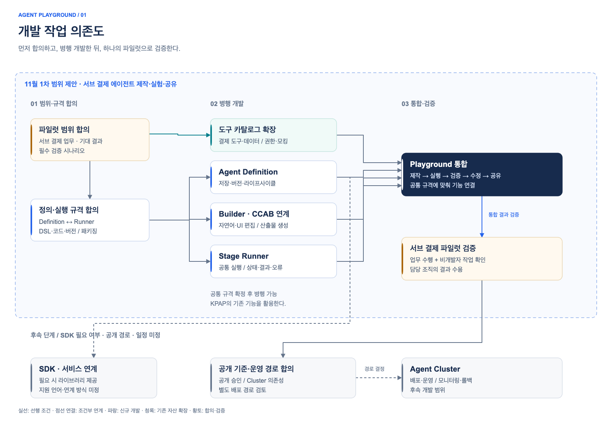
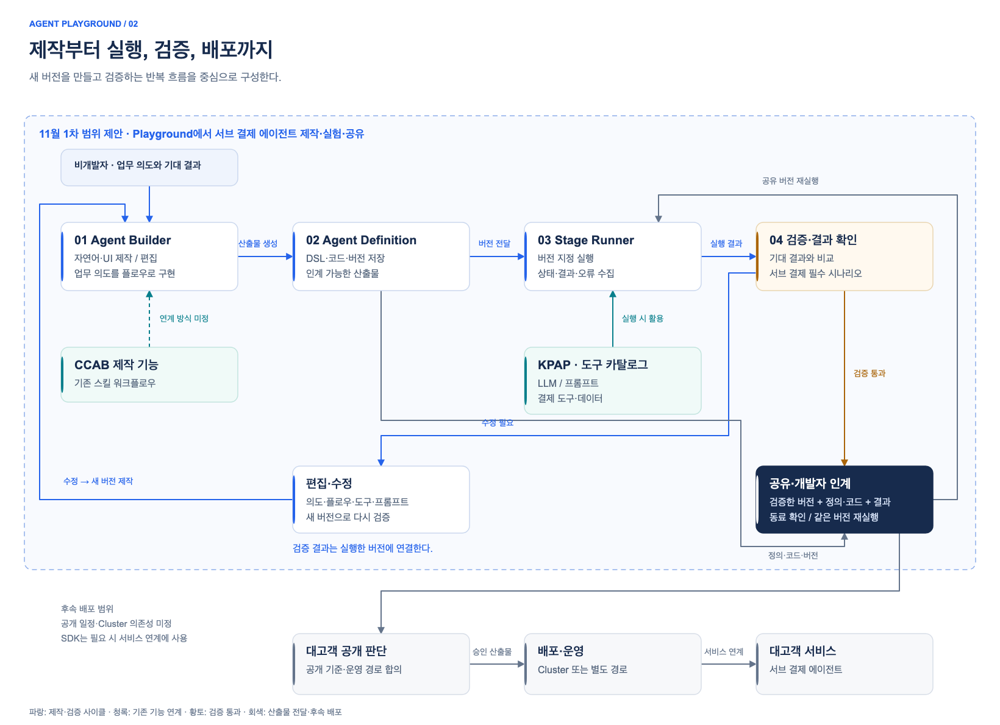

# Agent Playground 제품 범위 및 개발 계획

> 팀 합의용 초안. 팀은 범위와 계획을 합의한 뒤 리더에게 방향 승인을 요청한다.

## 1. 핵심 방향

| 항목 | 내용 |
| --- | --- |
| 목적 | 비개발자의 대고객 에이전트 개발을 돕는다. |
| 핵심 사용자 | 에이전트를 적극적으로 사용하려는 비개발자 |
| 최우선 성과 | CS 서브 결제 에이전트가 합의한 결제 업무를 수행한다. |
| 1차 일정 | 11월 중 결과물을 제공한다. 공개일과 공개 대상은 미정이다. |
| 개발 우선순위 | Playground → Builder → Agent Cluster |
| 부차적 성과 | 목적조직의 도구·데이터를 등록한다. 다른 에이전트에서 재사용한다. |

Playground는 에이전트의 제작·실행·검증·공유 환경이다. Builder, Stage Runner, Agent Cluster는 같은 서비스의 구성요소다.

1차 범위는 자연어·UI 제작 기능의 포함을 목표로 한다. 지원 기능은 팀에서 정한다.
사내 업무용 에이전트는 주 대상에서 제외한다.

## 2. 사용자 문제

중요도 순서로 정리한다. 핵심 대상은 관심과 사용 의지가 있는 비개발자다.

### 1순위: 관심 있는 비개발자

- CCAB로 에이전트를 만들었지만 다른 사람에게 공유하기 어렵다.
- 개발자에게 인계해도 개발자가 추가로 해야 할 작업이 많다.
- 별도 서비스로 개발한 뒤에도 에이전트 플로우를 변경·편집해야 한다.
- 대고객 도구·데이터가 부족해 원하는 기능을 구현하기 어렵다.

**대응**: 제작·실행·편집·공유를 연결한다. 인계 가능한 산출물과 필수 도구·데이터를 제공한다.

### 2순위: 관심이 낮은 개발자

- 에이전트 개발은 주로 Python 기반이다. 사내 프로젝트는 주로 Java·Kotlin 기반이다.
- 신규 실행환경을 구성하려면 K8s 구성 요청이 필요하다.

**대응**: 기존 서비스와의 연계 방법을 제공한다. 공통 실행환경으로 실험 준비 부담을 줄인다.

### 3순위: 관심이 낮은 비개발자

- 에이전트가 무엇인지, 무엇을 할 수 있는지, 어떤 한계가 있는지 모른다.
- 챗봇 기반 AI 서비스는 익숙하다. 실제 서비스에 적용할 접점을 찾기 어렵다.

**대응**: 파일럿과 예제로 활용 가능성과 한계를 보여준다.

### 직접적인 최적화 대상 아님: 관심 있는 개발자

- 로컬 개발이 더 빠르다. 플랫폼 사용이 오히려 병목이 될 수 있다.

**대응**: 필요한 플랫폼 기능을 선택해 사용하도록 안내한다.

## 3. 11월 1차 범위

**목표 흐름: 업무 정의 → 제작 → 실행 → 검증 → 편집 → 공유·인계**

아래 범위는 제안이다. 팀은 서브 결제 파일럿과 비개발자의 필수 작업을 기준으로 범위를 정한다.

| 영역 | 제공 기능 | 완료 기준 |
| --- | --- | --- |
| 정의·저장 | 에이전트 정의·코드·버전을 저장한다. | 실행 결과에서 에이전트 버전을 확인한다. |
| 제작·편집 | 자연어·UI로 제작·편집하는 기능을 목표로 한다. | 비개발자가 파일럿에 필요한 변경을 적용한다. |
| 실행·검증 | 공통 실행환경과 결과·오류를 제공한다. | 비개발자가 로컬 Docker 실행 없이 실행·검증을 반복한다. |
| 공유·인계 | 에이전트 버전과 검증 결과를 공유한다. | 동료가 결과를 확인한다. 개발자가 정의·코드를 받는다. |
| 도구·데이터 | KPAP와 도구 카탈로그를 연결한다. | 필수 도구·데이터를 사용한다. 없는 도구·데이터의 대안을 정한다. |
| 파일럿 검증 | 서브 결제 시나리오를 실행한다. | 업무 결과와 사용자가 막힌 단계를 기록한다. |

팀은 대고객 공개 시점과 승인 기준을 별도로 정한다.

## 4. 구성요소와 책임

### 기존 자산

| 자산 | 현재 기능 | 활용 방향 |
| --- | --- | --- |
| KPAP | 프롬프트 관리, 도구 관리, LLM Gateway | 기존 플랫폼 기능을 사용한다. |
| CCAB | Claude Code와 스킬 워크플로우로 LangGraph 코드를 만든다. 로컬에서 Docker 이미지를 빌드하고 컨테이너로 실행한다. | 공통 정의 규격과 실행환경에 연결한다. |
| 도구 카탈로그 | 기존 도구를 관리한다. | 파일럿에 필요한 도구·데이터를 연결한다. |

도구 카탈로그는 기존 자산을 확장한다. 나머지 Playground 구성요소는 새로 개발한다.
팀은 CCAB의 재사용 방식을 정한다.

### 개발 대상

| 구성요소 | 책임 | 결정할 사항 |
| --- | --- | --- |
| Agent Definition | 정의 규격(DSL), 코드, 버전, 라이프사이클을 관리한다. | 프레임워크, 토폴로지, 편집 기준 산출물, 코드 변경의 UI 반영 방식 |
| Agent Builder(Builder) | 자연어·UI로 플로우를 제작·편집한다. 정의·코드를 생성한다. | 1차 편집 범위, 자연어 변경의 확인 방식 |
| Agent Stage Runner(Stage Runner) | 편집한 에이전트를 실행한다. 상태·결과·오류를 제공한다. | 실행·패키징 규격, CI/CD 또는 Hot reload 방식 |
| CCAB 연계 | CCAB의 제작 기능을 공통 정의·실행 규격에 연결한다. | Builder 내부 기능으로 사용할지, 별도 제작 경로로 사용할지 |
| SDK | Builder 산출물을 라이브러리로 제공한다. | 파일럿에 필요한지, 지원 언어, 서비스 연결 방식 |
| 도구 카탈로그 확장 | 도구·데이터의 검색·연결·재사용을 지원한다. | 필수 도구·데이터, 권한, 제작·연결 자동화, 모킹 도구 |
| Agent Cluster | 검증한 에이전트를 배포·운영한다. | 개발 일정, 코드 없는 배포, 모니터링, 장애 대응, 롤백 |

**개발 순서: Agent Definition과 Stage Runner의 규격 합의 → Builder·CCAB 연결 → 파일럿 검증**

도구·데이터도 파일럿 검증 전에 준비한다. 팀은 다음 항목을 검토한다.

- Stage Runner 도입 후 제외할 Claude Desktop 실행 요구사항
- 도구별 소유 조직과 접근 권한
- 테스트 데이터와 모킹 도구의 필요 여부
- 사람의 확인·승인(HITL)이 필요한 작업
- 쓰기 도구의 멱등성, 보상 트랜잭션, 복구 책임
- 서브 결제 에이전트 공개에 Agent Cluster가 필요한지, 별도 운영 경로를 사용할지

### 개발 작업 의존도

[draw.io 원본 — 1번 페이지](diagrams/agent-playground.drawio)

### 구성요소 흐름과 검증 사이클

[draw.io 원본 — 2번 페이지](diagrams/agent-playground.drawio)

점선 영역은 11월 1차 범위 제안이다. SDK의 필요 여부와 배포 경로는 미정이다.

## 5. 성공 기준과 KPI

**제품의 가치는 파일럿과 사용자 작업으로 확인한다. 확산은 참여 서비스 수로 측정한다.**

### 5.1 제품 성공 기준

| 핵심 가치 | 확인할 결과 |
| --- | --- |
| **업무에 쓸 수 있는 에이전트를 만든다.** | CS 서브 결제 에이전트가 필수 시나리오를 통과한다. 업무 담당 조직이 결과를 수용한다. |
| **비개발자가 직접 실행·검증하고 개선한다.** | 비개발자가 자연어·UI로 플로우를 제작·편집한다. 공통 실행환경에서 실행 결과를 확인한다. |
| **결과를 공유하고 개발자에게 전달한다.** | 동료가 공유한 버전과 실행 결과를 확인한다. 개발자가 정의·코드를 후속 개발에 사용한다. |

필수 결제 시나리오는 정상 처리, 예외 처리, 도구 실패를 포함한다.
팀과 업무 담당자는 평가 전에 기대 답변·도구 동작·처리 결과를 합의한다.
팀은 대고객 공개 기준을 별도로 정한다.

### 5.2 확산 KPI

| KPI | 의미 | 집계 기준 |
| --- | --- | --- |
| **에이전트를 제작한 고유 서비스 수** | 에이전트 개발에 참여한 서비스의 수 | Builder·Playground에서 에이전트를 제작하고 실행한 서비스를 센다. 초안만 저장한 서비스는 제외한다. |
| **도구를 추가한 고유 서비스 수** | 도구 추가에 참여한 서비스의 수 | 신규 도구를 카탈로그에 추가하고 호출 검증을 완료한 서비스를 센다. 기존 도구만 사용한 서비스는 제외한다. |

- 서비스 ID로 서비스를 구분한다.
- 각 KPI에서 같은 서비스는 한 번만 센다. 에이전트·도구를 여러 개 만들어도 같다.
- 공개 이후의 누적 고유 서비스 수와 월별 고유 서비스 수를 기록한다.
- 누적값은 공개 이후 참여한 서비스 ID를 중복 없이 센다. 월별 값을 더하지 않는다.
- 팀은 참여 대상과 확산 계획을 정한 뒤 목표 서비스 수를 합의한다.

두 KPI는 확산을 측정한다. 작업 개선과 에이전트 품질은 5.1의 성공 기준으로 확인한다.

### 5.3 확인 방법

- 에이전트에 서비스 ID, 제작자, 버전, 실행 결과를 기록한다.
- 도구에 추가한 서비스의 ID, 등록일, 호출 검증 결과를 기록한다.
- 제품 담당자는 월별 참여 서비스 수를 집계한다.
- 업무 담당자는 서브 결제 수행 결과를 판정한다.
- 제품 담당자는 파일럿에서 사용자가 막힌 단계와 개발자 지원 내용을 기록한다. 팀은 이 기록으로 제품을 개선한다.

## 6. 로드맵

| 단계 | 시점 | 완료 결과 |
| --- | --- | --- |
| 범위·규격 합의 | 1차 제공 전 | 파일럿 업무, 지원 기능, 실행 규격, 필수 도구·데이터를 정한다. |
| Playground 1차 제공 | **11월 중** | 제작·실행·검증·공유 기능을 제공한다. 서브 결제 파일럿으로 검증한다. |
| 서브 결제 개선·대고객 공개 | 미정 | 에이전트가 업무 수행 기준을 충족한다. 대고객 공개 조건을 충족한다. |
| Builder·Agent Cluster 확장 | 미정 | 편집·배포·운영 기능을 확대한다. 도구·데이터 재사용을 지원한다. |

## 7. 팀 결정사항

1. **파일럿**: 서브 결제 업무, 참여 조직, 담당자, 업무 수행 기준을 정한다.
2. **1차 범위**: 공개 대상, 필수 작업, 자연어·UI 편집 기능을 정한다.
3. **개발 방식**: 정의·실행 규격, CCAB 재사용 방식, SDK 필요 여부를 정한다.
4. **실행 조건**: 도구·데이터 접근 권한, 쓰기 승인·복구 책임, 대고객 운영 경로를 정한다.
5. **개발 계획**: 구성요소별 담당자, 작업량, 외부 선행 조건을 정한다.

팀은 리더에게 제품 방향, 11월 범위, 파일럿 성공 기준, 필요한 자원을 제시한다.
