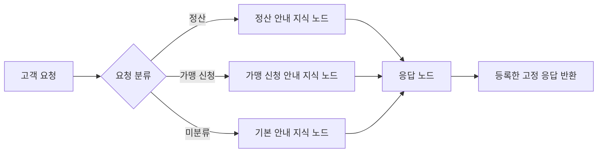
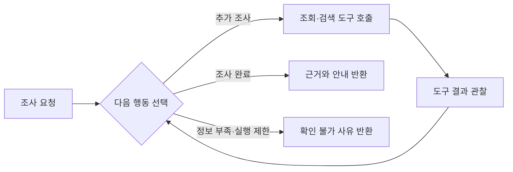

# AI Playground 브랜딩 컨셉과 제공 기능

관련 문서: [제품 범위 및 개발 계획](agent-playground.md).

## 1. 브랜드 정의와 해결할 문제

**AI Playground는 서비스에 필요한 AI 기능을 만들고, 실행하고, 검증하는 환경이다.**

비개발자는 업무 목적과 기대 결과를 설명한다. 실행 결과를 확인하고 기능을 수정한다.
개발자는 검증한 버전을 받아 기존 서비스에 연결한다.
**AI 기능을 만들고, 검증하고, 서비스에 연결한다.**

| 항목 | 정의 |
| --- | --- |
| 제품명 | AI Playground |
| 플랫폼과 함께 표기 | KPAP AI Playground |
| 핵심 사용자 | AI를 적극적으로 사용하려는 비개발자. 서비스 업무와 기대 결과를 이해한다. |
| 적용 사용자 | 기존 Java·Kotlin 서비스에 AI 기능을 연결하는 개발자 |
| 제작 단위 | AI 기능. 실행 방식은 AI 함수·AI 워크플로우·AI 에이전트로 구분한다. |
| 최우선 성과 | CS 서브 결제 파일럿이 합의한 업무를 수행한다. |
| 부차적 성과 | 목적조직의 도구·데이터를 등록하고 다른 AI 기능에서 재사용한다. |

### 사용자 문제와 제품의 대응

| 사용자 문제 | 제품의 대응 |
| --- | --- |
| CCAB에서 만든 결과를 공유하기 어렵다. | 기능 버전과 검증 결과를 연결해 동료와 개발자에게 전달한다. |
| 개발자가 인계 후 추가로 해야 할 작업이 많다. | 정의·코드·실행 조건을 전달한다. SDK로 같은 산출물을 실행한다. |
| 서비스 적용 후에도 처리 흐름을 수정해야 한다. | 제작자가 수정본을 검증한다. 개발자는 지정한 버전을 서비스에 반영한다. |
| 필요한 대고객 도구·데이터가 부족하다. | 기존 도구를 찾고 연결한다. 부족한 도구·데이터와 담당 조직을 확인한다. |
| 신규 실행 환경을 준비하는 부담이 크다. | 공통 테스트 환경을 제공한다. 제작자는 로컬 Docker 설정 없이 시험한다. |

사용자는 입력과 설정을 바꾸고 결과를 확인한다. 검증한 기능을 수정하거나 다른 기능과 연결한다.
우선 대상은 대고객 서비스에 적용할 AI 기능이다.

## 2. 세 가지 제공 형태

모든 AI 기능은 목적, 입력, 출력과 버전을 갖는다.

| 유형 | 제공 형태 | 실행 방식 | 대표 결과물 |
| --- | --- | --- | --- |
| AI 함수 | 입력·출력과 처리 규칙을 설정하는 기능 단위 | 정해진 입력을 처리하고 결과를 반환한다. | 문의 분류, 정보 추출, 요약, JSON 구조화 |
| AI 워크플로우 | 단계와 조건을 연결하는 처리 흐름 | 제작자가 정한 순서와 분기 규칙을 실행한다. | 분류 → 주문 조회 → 정책 확인 → 답변 작성 |
| AI 에이전트 | 목표·도구·행동 범위를 설정하는 실행 단위 | 관찰 결과에 따라 다음 행동과 도구를 선택한다. | 필요한 정보를 조사하고 해결 방법을 선택하는 지원 기능 |

AI 워크플로우는 AI 함수와 AI 에이전트를 단계로 사용할 수 있다.
AI 에이전트도 등록한 AI 함수나 AI 워크플로우를 도구로 사용할 수 있다.
호출은 지정한 버전과 허용한 권한을 기준으로 한다. 재사용 연결은 단계적으로 제공한다.

자연어는 기능을 만드는 방법이다. 채팅은 기능을 사용하는 인터페이스다.
분류에 LLM을 쓰거나 워크플로우를 자연어로 만들어도 자율 실행을 뜻하지 않는다. [Anthropic](https://www.anthropic.com/engineering/building-effective-agents), [LangGraph](https://docs.langchain.com/oss/python/langgraph/workflows-agents)

## 3. 유형별 제작과 검증 기능

### AI 함수

**AI 함수는 하나의 처리 목적과 명확한 입출력을 제공한다.**

제작자는 입력 필드, 출력 형식, 처리 지침과 예시를 설정한다.
플랫폼은 설정 화면과 테스트 입력 화면을 제공한다.
단순한 기능을 만들기 위해 그래프를 편집할 필요는 없다.

| 영역 | 플랫폼에서 제공할 기능 |
| --- | --- |
| 초안 제작 | 자연어로 목적과 기대 결과를 설명한다. 플랫폼이 프롬프트와 입출력 설정의 초안을 만든다. |
| 입출력 설정 | 입력 필드와 필수값을 지정한다. 출력은 텍스트, 분류값 또는 구조화된 데이터로 정의한다. |
| 처리 설정 | 프롬프트, 허용된 모델, 분류 기준과 예시를 편집한다. 필요한 코드 처리는 코드 노드로 분리한다. |
| 테스트 | 테스트 입력과 기대 결과를 지정한다. 실행 결과, 출력 형식 오류와 실행 오류를 확인한다. |
| 결과 확인 | 분류값, 추출한 값과 업무 적합성을 확인한다. JSON 형식 검증과 내용의 정확성 검증을 구분한다. |
| 개선 | 같은 사례로 수정본을 다시 실행한다. 버전별 결과를 확인한다. |
| 서비스 연결 | 개발자가 지정한 버전을 SDK로 호출한다. 입력을 전달하고 결과와 오류를 처리한다. |

#### 샘플 가맹점 분류 함수

가맹점 플랫폼이 상호명, 업종 설명과 판매 품목을 전달한다.
함수는 지정한 업종 중 하나를 반환한다. 정보가 부족하면 `분류 불가`를 반환한다.

- 입력: `상호명=모닝빈`, `업종 설명=음료와 디저트 판매`, `판매 품목=커피·케이크`.
- 출력: `{"category": "카페"}`.
- 제작: 분류 목록, 분류 기준, 입력 필드와 출력 형식을 설정한다.
- 검증: 카페·음식점·소매점 사례와 정보 부족 사례의 분류 결과를 확인한다.

### AI 워크플로우

**AI 워크플로우는 여러 기능과 도구를 정해진 처리 흐름으로 연결한다.**

제작자는 자연어 또는 캔버스로 단계와 조건을 구성한다.
플랫폼은 단계별 설정과 연결 검사를 제공한다.
처리 순서는 제작자가 정한다. AI 판단은 지정한 단계 안에서 수행한다.

| 영역 | 플랫폼에서 제공할 기능 |
| --- | --- |
| 초안 제작 | 자연어로 처리 절차를 설명한다. 플랫폼이 지원하는 노드와 연결의 초안을 만든다. |
| 흐름 편집 | AI 함수, 도구 호출, 조건 분기와 결과 반환을 연결한다. 자연어 변경안을 확인하고 적용한다. |
| 데이터 연결 | 단계의 입력과 출력 관계를 지정한다. 플랫폼이 없는 참조와 호환되지 않는 연결을 검사한다. |
| 조건 설정 | 분기 조건과 예외 경로를 설정한다. 승인·중단·재개는 필요한 업무에 추가한다. |
| 테스트 | 정상 입력, 조건 불충족과 도구 실패 사례를 실행한다. 선택한 경로와 단계별 결과를 확인한다. |
| 결과 확인 | 실패한 단계, 전달한 입력과 도구 호출을 확인한다. 기대한 분기와 업무 결과가 나왔는지 판단한다. |
| 서비스 연결 | 개발자가 같은 버전의 전체 흐름을 SDK로 실행한다. 서비스의 인증·데이터·도구 연결을 통합 검증한다. |

CS 서브 결제 파일럿에서는 문의 해석, 조회, 정책 확인과 답변을 연결할 수 있다.
실제 순서와 처리 범위는 업무 담당자와 정한다.

#### 샘플 요청 분류와 고정 응답 워크플로우

고객 요청을 분류하고 해당 지식 노드를 선택한다.
지식 노드는 사전 등록한 안내문을 제공한다. 응답 노드는 해당 문구를 그대로 반환한다.

- 입력: `정산은 언제 입금되나요?`.
- 출력: 정산 안내 지식에 등록한 고정 응답.
- 제작: 요청 유형, 지식 노드와 고정 응답을 연결한다. 미분류 요청의 기본 응답도 설정한다.
- 검증: 정산·가맹 신청·미분류 사례에서 경로와 응답 문구를 확인한다.

### AI 에이전트

**AI 에이전트는 목표를 받으며, 허용한 범위에서 다음 행동을 선택한다.**

제작자는 세부 호출 순서보다 목표, 완료 조건, 사용할 도구와 제한을 설정한다.
플랫폼은 목표·도구 설정 화면과 작업 실행 기록을 제공한다.
필수 업무 절차는 고정된 워크플로우로 제한할 수 있다.

| 영역 | 플랫폼에서 제공할 기능 |
| --- | --- |
| 초안 제작 | 자연어로 역할, 목표와 기대 결과를 설명한다. 플랫폼이 실행 지침의 초안을 만든다. |
| 도구 설정 | 등록한 도구를 선택한다. 도구별 입력과 허용한 호출 범위를 확인한다. |
| 실행 제한 | 반복 횟수, 실행 시간, 종료 조건과 승인 조건을 설정한다. 세부 한도는 지원 범위에 맞춘다. |
| 맥락 설정 | 현재 요청, 업무 상태와 필요한 대화 이력을 구분한다. 장기 기억은 별도 기능으로 다룬다. |
| 테스트 | 작업 목표와 테스트 데이터를 넣는다. 정보 부족, 도구 실패와 제한 도달 사례도 실행한다. |
| 결과 확인 | 호출한 도구, 전달한 입력, 받은 결과와 종료 사유를 확인한다. 목표 달성과 불필요한 행동을 함께 판단한다. |
| 개선·연결 | 지침·도구·제한을 수정해 다시 실행한다. 검증한 버전을 SDK 또는 다른 흐름에서 호출한다. |

AI 에이전트는 채팅 외의 입력으로도 호출할 수 있다.

#### 샘플 ReAct 결제 실패 원인 조사

AI 에이전트는 [ReAct](https://react-lm.github.io/) 방식으로 결제 실패 원인을 조사한다.
주문 조회, 결제 이력 조회와 오류 안내 검색 중 필요한 도구를 선택한다.
도구 결과를 확인하고 추가 조회 또는 답변을 선택한다.

- 입력: `주문 O-123의 결제가 실패한 이유를 알려주세요.`.
- 출력: 확인한 실패 원인과 안내. 원인을 확인하지 못하면 확인 불가 사유를 반환한다.
- 제작: 조사 목표, 조회 도구, 종료 조건과 호출 한도를 설정한다. 결제 변경 도구는 제공하지 않는다.
- 검증: 도구 선택, 조회 결과의 근거, 정보 부족·도구 실패·한도 도달 시 종료를 확인한다.

### 공통 제공 기능

**세 유형은 같은 버전 관리와 실행·인계 흐름을 사용한다.**

| 공통 기능 | 제공할 내용 |
| --- | --- |
| 제작·편집 | 자연어와 UI로 지원 범위의 설정을 변경한다. 변경안은 적용 전에 확인한다. |
| 저장·버전 | 편집본을 저장한다. 테스트 대상의 정의·코드·설정을 버전으로 고정한다. |
| 공통 실행 | Stage Runner에서 실행한다. 준비 상태, 완료 결과와 오류를 표시한다. |
| 검증 사례 | 입력, 기대 결과와 실제 결과를 연결한다. 수정 후 같은 사례로 다시 시험한다. |
| 공유·인계 | 지정한 버전, 필요한 도구·설정과 검증 근거를 동료와 개발자에게 전달한다. |
| 서비스 적용 | Java·Kotlin 서비스가 SDK로 같은 산출물을 실행한다. 기존 서비스 배포 절차를 사용한다. |
| 도구·데이터 | KPAP의 프롬프트·LLM·도구 기능과 기존 도구 카탈로그를 활용한다. |

제작 대화는 기능을 수정한다. 테스트 실행은 만든 기능을 시험한다.
단일 요청 입력과 구조화된 출력도 지원 대상으로 둔다. 대화 이력은 필요한 기능에서 사용한다.

## 4. 1차 제공 범위와 확장 방향

**11월에는 CS 서브 결제 파일럿의 제작부터 서비스 인계까지 검증한다.**

파일럿에 필요한 공통 제작·실행 기능을 먼저 완성한다.
유형별 전용 화면과 검증 기능은 단계적으로 제공한다.

| 구분 | 범위 |
| --- | --- |
| 1차 우선 경험 | 자연어 초안 제작, 지원 범위의 UI 편집, 버전 고정, 테스트 실행, 결과·오류 확인과 산출물 인계 |
| 1차 적용 | Java·Kotlin 서비스 내부에서 SDK로 실행한다. JDK 17 이상을 기준으로 검증한다. |
| 1차 편집 범위 | 지원 노드와 조건 분기를 우선한다. 범용 데이터 연결과 모든 흐름 유형은 확장 대상으로 둔다. |
| 조건부 기능 | DB 상태 저장·재개, 사람 승인과 쓰기 도구는 파일럿 요구에 따라 포함한다. |
| 확장 방향 | AI 함수의 전용 설정·검증 화면, 구조화된 입출력, 기능 재사용과 다양한 호출 방식을 넓힌다. |
| 별도 개발 범위 | 전용 공유 화면, 시험 결과의 영구 보관, 자동 회귀 검증과 품질 자동 판정 |
| 후속 운영 | 일반 배포·운영 기능은 별도 계획으로 정한다. |

현재 MVP의 테스트 진입점은 대화형이다.
AI 함수의 필드 입력과 출력 형식 검증은 추가 구현 대상이다.

제품의 성과는 세 가지로 확인한다.

- 서브 결제 파일럿이 합의한 업무 결과를 충족한다.
- 비개발자가 제작·실행·검증·수정을 수행한다.
- 개발자가 검증한 버전을 받아 서비스에서 실행한다.

확산은 AI 기능을 제작한 고유 서비스 수와 도구를 추가한 고유 서비스 수로 확인한다.
서비스 ID로 중복을 제거한다. AI 함수와 AI 워크플로우도 제작 참여에 포함한다.

